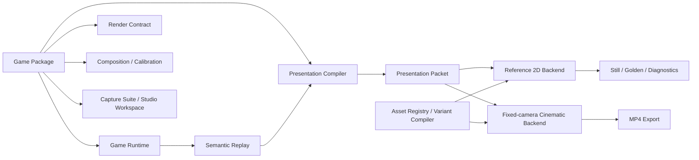

# Block Creative Studio

**面向 IAA 消除类游戏投放素材的浏览器创作、导演与固定机位渲染平台。**

Block Creative Studio（BCS）从可复现的二维玩法真值出发，把游戏规则、玩家操作、演出节奏、视觉资产和视频渲染拆成独立层，再在固定摄像机下完成材质化、空间化和特效合成，输出具有三维质感的竖屏投放视频。

> 项目名源于第一款 **Block Placement** 原型，但系统目标并不局限于方块游戏。BCS 正在建设一个可注册多款 IAA 消除玩法的“游戏市场”：每款游戏拥有独立规则与演出模块，共享同一套资产、导演、渲染、导出和质量基础设施。

当前版本：`0.3.0-alpha.4`  
当前可制作游戏：**Block Placement**  
规划接入：**Block Crush Drop**、**Vita Mahjong Solitaire**

---

## 核心命题

```text
二维 Gameplay Truth
        ↓
Semantic Replay / Rule Resolution
        ↓
导演节奏与 Presentation
        ↓
固定摄像机下的空间化、材质化和特效演出
        ↓
确定性逐帧渲染
        ↓
1080×1920 投放视频
```

这里的“二维”指玩法规则与最终状态，而不是最终画面只能是平面图形。

- Block Placement 的落子、合法性、满行满列和计分在二维格阵中求解；
- Block Crush 的落块、破坏集合和坍塌目标仍由二维规则决定；
- Vita Mahjong 的牌面位置、离散层级、覆盖关系、左右阻塞和配对关系属于分层二维拓扑；
- 厚度、倒角、PBR 材质、灯光、阴影、纵深、碎片、粒子和物理次级运动都属于表现层。

因此，BCS 不是用三维物理“猜”玩法结果，而是让可信的二维玩法驱动固定机位下的高质量三维化成片。

---

## 为什么需要这个系统

传统投放素材生产经常把玩法、操作、镜头、特效和换皮绑在同一个工程里。结果是改一个材质可能破坏动画，改一个节奏需要重新录玩法，换一个游戏又要重建整套工具链。

BCS 重点解决四件事：

| 目标 | 系统做法 |
|---|---|
| **玩法拟真** | 规则由独立 Game Runtime 执行；人类与 Agent 共用语义 Action，不依赖视频像素推测结果 |
| **视觉质量** | Reference 2D 锁定布局与时序，固定机位 Cinematic Backend 负责材质、体积、灯光、碎片和后处理 |
| **高效变体** | Replay、导演节奏、Look、材质和输出参数相互解耦，同一盘玩法可以反复换皮和重导 |
| **批量生产** | 版本化资产、Variant Compiler、Quality Gate、稳定 Hash 和固定帧导出让结果可审计、可复现 |

BCS 不是通用游戏引擎，也不是自由摄像机的三维编辑器，更不是一次性 Prompt-to-Video 工具。它专注于一个更窄但更深的生产问题：

> **如何稳定地产出玩法可信、画面高质量、可持续换皮和批量迭代的消除类游戏投放视频。**

---

## 三层真值

### 1. Gameplay Truth

决定“游戏里真正发生了什么”：

- 初始状态与关卡配置；
- 合法 Action；
- Commit / Detect / Resolve / Reconfigure / Settle；
- 被删除、移动、生成或解锁的实体；
- 分数、连击、目标和终局；
- 最终状态 Hash。

玩法层不依赖 React、Canvas、Three.js、摄像机或实时帧率。

### 2. Presentation Truth

决定“这些规则结果应该怎样被观众看见”：

- 拾取、拖拽、落块和点击的时长；
- 预消除、撞击、清除、坍塌和配对退场的节奏；
- Camera Punch、曝光脉冲、Combo 和反馈文字；
- 导演轨迹、目标约束运动与特效峰值；
- 固定帧 Presentation Packet。

玩法相同的 Replay 可以应用不同导演节奏，而不改变规则结果。

### 3. Pixel Truth

决定最终每一帧的像素：

- Screen 2D、Sprite、Shader、浅三维几何和 Mesh；
- PBR 材质、法线、粗糙度、金属度和环境反射；
- 固定摄像机、构图、阴影、碎片、粒子与后处理；
- Canvas / WebGL 合成与 WebCodecs 编码。

Reference 2D 与固定机位 Cinematic Backend 可以使用不同绘制实现，但必须共享同一份玩法、Replay、事件身份和帧时间。

---

## 多游戏平台

每款游戏都是一个独立的 **Game Package**，而不是平台代码中的一组 `if (gameId === ...)`。



### 平台统一提供

- Game、Schema、Presentation、Render Contract、Backend、Capture 与 Studio Registry；
- Project / Replay Envelope 与语义校验；
- Asset Registry、Look Pack、Material Pack、Effect Pack 和 Variant Compiler；
- `frame-exact`、`semantic`、`rule-only` 三种不变量策略；
- Composition、Calibration、固定机位和资源就绪合同；
- Reference 2D、固定机位渲染、Capture、Golden 与 WebCodecs 导出；
- Architecture Guard、确定性 Hash、测试与 CI。

### 每款游戏单独提供

- State、Action、Ruleset 与 Resolution；
- 玩法拓扑和合法动作；
- 规则事件到演出事件的编排；
- 棋盘、候选区、HUD 和交互布局；
- 游戏自己的语义资产 Slot、Pass 与质量要求；
- Studio Workspace、Capture Suite 和参考证据。

---

## 游戏目录

| 游戏 | 玩法真值 | 主要动作 | Resolve / Reconfigure | 当前状态 |
|---|---|---|---|---|
| **Block Placement** | 8×8 二维格阵 | 从三个候选块中拖拽落子 | 满行、满列同步清除；通常不发生整体移动 | **可运行、可编辑、可导出** |
| **Block Crush Drop** | 二维格阵与支撑/重力关系 | 从上方投放块 | 冲击或结构破坏；幸存块坍塌并重新稳定 | 平台契约已验证，正式游戏模块未实现 |
| **Vita Mahjong Solitaire** | 二维平面 + 离散层级 + 阻塞图 | 选择两张可用同类牌 | 移除配对并重算覆盖、左右阻塞和可用集合 | 架构已预留，正式游戏模块未实现 |

未来的新游戏不要求共享同一种 Board 或 Action；只需要遵守统一的生产协议。

---

## 当前可运行能力

### Block Placement 玩法与 Replay

- 8×8 棋盘、三个候选块、18 种基础形状和七色 Token；
- 合法落子、重叠拒绝、满行满列同步清除、候选刷新和失败判断；
- 棋盘、候选块和逐格颜色编辑；
- 真人鼠标/触摸试玩与规则型机器玩家；
- 语义 Action、归一化指针轨迹、Seed、Take 与确定性 Replay；
- 多套导演节奏，可在不重下的情况下改变演出速度和停顿。

### Reference 2D 与固定机位成片

- Reference 2D 用于锁定棋盘、HUD、候选区、事件时序和 Golden 校准；
- 固定机位 Cinematic Backend 提供厚度、倒角、PBR 材质、灯光、阴影、碎片和后处理；
- 不锈钢、橡木与参数化 Aurora 材质示例；
- Albedo、Roughness、Metalness 等诊断视图；
- 原生设计分辨率 Capture 与 1080×1920 H.264/MP4 导出；
- 固定时间步逐帧重演，导出速度可以慢于实时，但动作帧位不会随机器负载漂移。

### 资产、变体与 Agent 接口

- 浏览器 IndexedDB Asset Store，二进制资产按 SHA-256 持久化；
- 上传背景、牌面、材质贴图及其他版本化资产；
- `CreativeMaster + VariantRecipe → ResolvedRenderPlan`；
- 材质外观与材质行为分离，Effect Pack 可校验材质兼容性；
- Plan-bound Prepared Resources，正式渲染前校验 Plan Hash 和 Required Slots；
- Agent-neutral Headless Core 与机器可读 CLI；
- 外部 Agent、DCC、程序化工具或设计师都可以生产资产与 Recipe，BCS 负责校验、编译和渲染。

系统本身不内置 LLM。它提供的是适合 Agent 调用的稳定协议，而不是把 Prompt 面板硬塞进创作流程。

---

## 快速开始

要求：

- Node.js `22.12+`
- npm `10+`
- 近期桌面版 Chrome

```bash
git clone https://github.com/dongyuan21/block-creative-studio.git
cd block-creative-studio
npm install
npm run dev
```

浏览器打开：

```text
http://127.0.0.1:4173
```

首次体验建议导入：

```text
examples/demo-cross-clear.block-creative.json
```

然后进入 **导演回放**，分别尝试 Reference 2D 与固定机位 Cinematic Look，再导出 1080×1920 MP4。

本机视觉评审请按 [`docs/LOCAL_REVIEW_AND_FEEDBACK.md`](docs/LOCAL_REVIEW_AND_FEEDBACK.md) 的统一片单执行，避免不同输入之间无法对比。

---

## 校验与构建

```bash
npm run check
npm test
npm run typecheck
npm run build
npm run test:browser-e2e
```

完整的公开 Fixture 捕获：

```bash
npm run capture:review
```

该命令会生成 Still 和无声 MP4，用于工程回归与差异检查。使用 SwiftShader 或公共 Fixture 得到的 PASS 只代表工程链路通过，不代表商业画质已获人工批准。

---

## Headless CLI

```bash
npm run build:cli
node dist-cli/cli/bcs.js capabilities
```

示例：编译一个 Variant 并执行结构质量检查。

```bash
node dist-cli/cli/bcs.js variant compile \
  --master examples/headless/master.demo.json \
  --recipe examples/headless/variant.copper.demo.json \
  --assets examples/headless/assets \
  --renderer fixed-camera-cinematic \
  --require-hashes \
  --out /tmp/bcs-plan.json

node dist-cli/cli/bcs.js quality check \
  --plan /tmp/bcs-plan.json \
  --strict \
  --require-hashes
```

CLI 负责 Schema、资产、Plan 和质量报告；当前 MP4 仍由浏览器 Chrome + WebCodecs 生成，Node CLI 不会宣称 `rendered: true`。

---

## 目录结构

```text
src/
├── game-runtime/              # 多游戏 State / Action / Replay / Schema 协议
├── games/
│   └── block-placement/       # 第一款完整游戏 Vertical Slice
├── bootstrap/                 # Game Package 与平台组装
├── headless/                  # Asset、Variant、Quality、Material 等无头核心
├── rendering/                 # Backend、Composition、资源策略与 Render Job
├── capture/                   # 诊断、Golden 与浏览器捕获
├── studio/                    # 与具体游戏无关的 Studio Shell
├── assets/                    # 浏览器资产存储和运行时绑定
└── exporter/                  # WebCodecs / MP4 导出入口
```

平台层禁止反向依赖具体游戏；不同游戏包之间也不能相互导入。`scripts/check-architecture.mjs` 会在 CI 中持续检查这些边界。

---

## 当前阶段与边界

| 项目 | 状态 |
|---|---|
| 多游戏平台 R0–R8b | 已完成并合入 `main` |
| Block Placement | 当前唯一可制作游戏 |
| Block Crush / Vita Mahjong | 尚未实现正式模块 |
| 商业参考 Golden | `BLOCKED`：公共仓库不包含商业源视频 |
| 人工视觉批准 | `PENDING` |
| 音频、BGM、旁白 | 尚未进入当前导出链 |
| R9：默认切换 V2、删除 Legacy 路径 | `DEFERRED`，等待第二款正式游戏验证 |

当前版本是架构与生产链路的 Alpha，不应把测试通过、公共 Fixture、软件 WebGL 或结构契约等同于最终广告品质。

---

## 文档导航

| 文档 | 内容 |
|---|---|
| [`docs/LOCAL_REVIEW_AND_FEEDBACK.md`](docs/LOCAL_REVIEW_AND_FEEDBACK.md) | 本机应该导出哪些视频，以及怎样提交可复现的视觉反馈 |
| [`docs/ENGINEERING.md`](docs/ENGINEERING.md) | 完整能力、命令、校验、Reference 审计和工程实现说明 |
| [`docs/ARCHITECTURE.md`](docs/ARCHITECTURE.md) | Gameplay Truth、Reference 2D、固定机位渲染与 DCC 扩展边界 |
| [`docs/reports/MULTI_GAME_REFACTOR_R0_R8B_DELIVERY.md`](docs/reports/MULTI_GAME_REFACTOR_R0_R8B_DELIVERY.md) | 多游戏平台重构交付证据与已知限制 |
| [`docs/cli/README.md`](docs/cli/README.md) | Headless CLI 使用说明 |
| [`docs/architecture/HEADLESS_CORE_V1.md`](docs/architecture/HEADLESS_CORE_V1.md) | Agent-neutral Headless Core |
| [`docs/architecture/ASSET_IMPORT_PIPELINE_V1.md`](docs/architecture/ASSET_IMPORT_PIPELINE_V1.md) | 外部资产进入系统的编译与运行链路 |

---

## DCC 与外部生产工具

Blender、After Effects 等 DCC 不直接成为玩法真值来源。未来它们更适合作为资产工厂，向 BCS 提供：

- 固定视角 Sprite / Flipbook；
- Mesh、材质和碎片资产；
- 预烘焙 Transform Track；
- 可重新打光或可换材质的中间资产；
- 明确 Camera Profile、空间表达、确定性和资源预算的 Runtime Asset。

这样可以保留专业 DCC 的画质，同时避免把批量出片流程重新绑回不可审计的手工工程。

---

## 许可与内容边界

代码采用 [MIT License](LICENSE)。

本仓库包含独立实现的玩法、工具链、测试 Fixture 和示例资产，不包含第三方游戏的品牌、原始美术、声音、源代码或内部算法。商业参考视频和截图不会提交到公共仓库；相关规则与视觉推断必须保留证据状态，不能把推测写成已验证事实。
