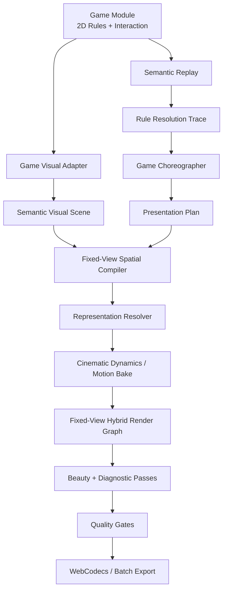

# 多游戏二维玩法真值与固定机位三维化系统设计 v1

- 状态：Proposed / 待 Review
- 适用仓库：`dongyuan21/block-creative-studio`
- 研究与设计日期：2026-09-03
- 首批覆盖游戏：
  - `block-placement`：当前 Block Placement
  - `block-crush-drop`：第二款 Block Crush
  - `vita-mahjong-solitaire`：未来 Vita Mahjong 类麻将消除

---

## 1. 决策摘要

BCS 的长期产品边界正式定义为：

> **面向 IAA 消除类广告素材的二维玩法仿真、导演与固定机位三维化渲染平台。**

所有受支持游戏都必须满足以下约束：

1. 玩法是否合法、哪些实体被消除、哪些实体移动到哪里、何时获胜或失败，由确定性的二维逻辑状态决定。
2. 固定摄像机下的厚度、透视、材质、光照、阴影、纵深、碎裂、粒子和物理，仅用于表现，不反向决定玩法结果。
3. Reference/诊断视图与正式三维化成片必须消费同一份状态、Replay、实体 ID、规则事件和最终落点。
4. 每款游戏只实现自己的规则模块、交互模块、视觉语义适配和导演策略；固定视图、材质化、动力学、合成、导出和质量门禁由平台复用。
5. 系统不追求成为通用 3D 游戏引擎，也不支持依赖自由摄像机或连续三维物理才能判定结果的玩法。

因此，项目级的核心命题不是：

```text
做一个 2D Renderer，再做一个 3D Renderer
```

而是：

```text
二维玩法真值
→ 语义场景
→ 固定视图空间化
→ 逐元素材质化与动力学演出
→ 混合渲染
→ 高质量投放视频
```

---

## 2. Vita Mahjong 初步调研结论

### 2.1 官方资料已经确认的事实

Vita Studio 将 Vita Mahjong 定位为面向老年人与休闲用户的麻将配对消除游戏，强调大尺寸、清晰牌面和易用界面。官方商店说明的核心目标是：选择图案相同且未被遮挡/阻塞的牌，将其成对移除，直至清空牌局；官方商店资料还明确提到 Hint、Undo、离线游玩以及逐步提高难度的关卡。

官方来源：

- Vita Studio 官网：<https://www.vitastudio.ai/>
- Google Play：<https://play.google.com/store/apps/details?id=com.vitastudio.mahjong>
- Apple App Store：<https://apps.apple.com/us/app/vita-mahjong/id6468921495>

商店截图可以观察到：

- 牌局是具有重叠关系的多层平面布局，而不是规则均匀的矩形格阵；
- 牌块通过厚度、阴影和遮挡呈现层级；
- 不同关卡具有不同的空间排布；
- HUD 可包含分数、剩余配对数、Hint、Shuffle、Undo 等元素；
- 部分当前截图中存在顶部容器/牌槽，但官方文字没有充分说明其规则语义。

### 2.2 当前不能直接写死的规则

仅凭官方商店文字与截图，以下内容仍必须通过真实版本录屏与逐步操作验证：

- “可用牌”的精确判定是否严格等于“上方无遮挡且左/右至少一侧开放”；
- 花牌、季节牌或特殊主题牌是否允许同组而非完全同图匹配；
- 顶部牌槽是展示、临时收集、关卡变体，还是新版核心机制；
- Combo 的重置窗口、计分公式与错误选择惩罚；
- Shuffle、Undo、Hint 对规则状态、Seed 和 Replay 的精确影响；
- 特殊关卡、Daily Challenge 和活动关卡是否引入额外目标。

这些内容在接入前必须按 `observed / inferred / unresolved` 分级，不得用麻将接龙的一般规则替代 Vita Mahjong 的真实规则。

### 2.3 对系统抽象的直接影响

Vita Mahjong 证明，“二维玩法真值”不能被误解为“所有游戏都是二维数组”。

它更适合建模为：

```text
二维平面坐标
+ 离散层级
+ 牌块二维轮廓
+ 覆盖/侧边阻塞关系
+ 匹配关系
```

离散层级只参与遮挡和可用性判定，不等同于自由三维世界。玩法不需要真实刚体、碰撞或摄像机投影来判断一张牌是否可选，因此它仍然属于本系统的二维逻辑边界。

---

## 3. “二维玩法真值”的精确定义

BCS 中的二维不是渲染技术，而是规则边界。

### 3.1 允许的逻辑表达

- 矩形或非矩形二维网格；
- Polyomino、单格、牌块等二维 Footprint；
- 多个二维 Surface；
- 离散层级与覆盖关系；
- 邻接图、支撑图、阻塞图和匹配图；
- 二维坐标上的交换、放置、下落、移除、解锁和合成；
- 由规则明确给出的最终目标位置。

### 3.2 不进入玩法真值的内容

- 摄像机焦距和角度；
- Mesh 的世界坐标；
- 物体抬起高度；
- 视觉旋转、翻滚和弹性；
- 刚体碰撞产生的随机位置；
- 碎片轨迹；
- 光照、Bloom、景深和运动模糊。

### 3.3 支持边界

系统支持：

```text
规则可以在二维平面、离散层或关系图上完整、确定地求解；
三维只用于把该结果表现得更真实、更有重量、更有广告爽感。
```

系统不支持：

```text
合法性或胜负必须依赖连续三维位置、自由相机观察、实时刚体堆叠结果或三维导航。
```

---

## 4. 三款游戏在同一抽象下的差异

| 阶段 | Block Placement | Block Crush | Vita Mahjong |
|---|---|---|---|
| 逻辑拓扑 | 二维格阵 | 二维格阵 + 支撑/重力关系 | 二维平面 + 离散层 + 阻塞图 |
| 主要交互 | 拖拽候选块到格子 | 选择/投放上方块 | 点击或滑动选择两张牌 |
| Commit | Piece 锚定到二维格位 | 计算投放与接触位置 | 第二张合法匹配牌确认配对 |
| Detect | 满行、满列 | 冲击、结构或特定模式 | 两牌匹配且均可用 |
| Resolve | 移除完整行列 | 压碎或移除目标实体 | 移除一对牌 |
| Reconfigure | 候选刷新，棋盘通常不移动 | 重力、支撑丢失、连锁坍塌 | 重算被覆盖与侧边阻塞关系 |
| Settle | 落子稳定 | 幸存块落到规则目标格 | 剩余牌保持规则位置，更新可用集 |
| 主要三维演出 | 抬起、落下、回弹、破碎 | 撞击、传播、翻卷、坍塌、碎裂 | 牌块厚度、层叠、选中抬升、配对退场 |

三款游戏共享生产管线，不共享具体规则代码。

---

## 5. 三层真值

### 5.1 Gameplay Truth

回答：

- 当前状态是什么；
- 某个动作是否合法；
- 哪些实体被创建、移动、移除或解锁；
- 连锁发生几轮；
- 分数、目标和胜负如何变化；
- 最终稳定状态是什么。

它必须是纯逻辑、可测试、可 Hash、可 Replay 的。

### 5.2 Presentation Truth

回答：

- 动作从哪一帧开始；
- 何时接触、破碎、更新分数和结束；
- 宏观运动轨迹、传播顺序和视觉峰值是什么；
- 哪些对象使用导演运动、受约束物理或自由物理；
- 屏幕反馈、音频和后处理如何重叠。

它可以改变节奏和视觉表达，但不能改变 Gameplay Truth。

### 5.3 Pixel Truth

回答：

- 每一帧实际提交哪些 Sprite、Card、Mesh、粒子和文字；
- 具体材质、光照、阴影和后处理参数；
- 最终输出哪些像素、诊断 Buffer 和音频样本。

Renderer 只能消费前两层真值，不能反向修改规则。

---

## 6. 目标架构



### 6.1 单向依赖

```text
Game Module
→ Replay / Rule Trace
→ Presentation Plan
→ Fixed-View Scene
→ Render Graph
→ Frame / Audio
→ Export
```

禁止出现：

```text
Renderer → 修改游戏状态
Physics → 决定最终格位
Three.js/Canvas → 判断动作是否合法
React UI → 持有唯一规则真值
```

---

## 7. Game Module 协议

平台不能维护一个包含所有游戏字段的万能 `GameState`。每款游戏使用独立类型，并通过泛型协议接入。

```ts
interface GameModule<
  Config,
  State,
  InteractionState,
  Intent,
  Action,
  Event
> {
  manifest: GameManifest;

  schemas: {
    config: RuntimeSchema<Config>;
    state: RuntimeSchema<State>;
    action: RuntimeSchema<Action>;
  };

  rules: Game2DRules<Config, State, Action, Event>;
  interaction: GameInteractionAdapter<
    State,
    InteractionState,
    Intent,
    Action
  >;
  replay: ReplayCodec<State, Action>;
  visual: GameVisualAdapter<State, InteractionState, Event>;
  choreographer: GameChoreographer<State, Action, Event>;
  studio: GameStudioContribution<Config, State, Intent>;
  bot?: GamePolicy<State, Action>;
}
```

### 7.1 GameManifest

```ts
interface GameManifest {
  id: string;
  version: string;
  displayName: string;
  description: string;
  coverAssetRef: AssetRef;

  topology: 'grid-2d' | 'layered-planar' | 'planar-graph';

  capabilities: {
    cascades: boolean;
    gravity: boolean;
    discreteLayers: boolean;
    undo: boolean;
    shuffle: boolean;
    bot: boolean;
  };

  maturity:
    | 'rule-auditing'
    | 'diagnostic-render'
    | 'cinematic-preview'
    | 'production';
}
```

`capabilities` 只用于市场展示、UI 能力开关和兼容性检查，不能作为实现规则的条件分支。

### 7.2 Registry

一期采用编译期 Registry：

```ts
const GAME_REGISTRY = {
  'block-placement': blockPlacementModule,
  'block-crush-drop': blockCrushModule,
  'vita-mahjong-solitaire': vitaMahjongModule,
};
```

平台公共代码不得散布：

```ts
if (gameId === 'vita-mahjong-solitaire') { ... }
```

所有差异必须收敛在模块注册点与模块内部。

---

## 8. 可组合的二维 Kernel

不建立万能 Board，只提供可组合 Kernel。

### 8.1 首批 Kernel

```text
kernels/grid-2d
kernels/polyomino
kernels/line-detection
kernels/gravity
kernels/support-graph
kernels/cascade
kernels/layered-planar-layout
kernels/occlusion-and-side-blocking
kernels/pair-matching
kernels/scoring-and-combo
```

### 8.2 Block Placement

复用：

```text
grid-2d
polyomino
line-detection
scoring-and-combo
```

### 8.3 Block Crush

复用：

```text
grid-2d
gravity
support-graph
cascade
scoring-and-combo
```

### 8.4 Vita Mahjong

复用：

```text
layered-planar-layout
occlusion-and-side-blocking
pair-matching
scoring-and-combo
```

建议逻辑牌块至少包含：

```ts
interface MahjongTileEntity {
  id: string;
  faceId: string;
  matchKey: string;
  footprint: PlanarRect;
  layer: number;
  removed: boolean;
}
```

`matchKey` 与 `faceId` 分离。后续若真实规则允许同组牌匹配，可以只调整规则数据；视觉换牌面也不会静默改变匹配逻辑。

---

## 9. Interaction Track 与 Semantic Replay 分离

第一款 Block 当前将 `pieceId + anchor` 与 `durationFrames + pointerPath` 放在同一个 Action 中。多游戏以后必须拆分。

### 9.1 Interaction Track

保存用户可见但不一定改变规则的过程：

- 指针移动、按下、抬起；
- 拖拽路径；
- Mahjong 第一张牌的选中、高亮与取消；
- Hint 展示；
- 非法点击；
- 触摸滑动轨迹。

### 9.2 Semantic Action Track

只保存会改变 Gameplay Truth 的动作：

```ts
{ type: 'place-piece', pieceId, anchor }
{ type: 'drop-piece', pieceId, lane }
{ type: 'match-pair', firstTileId, secondTileId }
{ type: 'shuffle' }
{ type: 'undo', targetStepId }
```

### 9.3 Replay Envelope

```ts
interface ReplayEnvelope<Action, Intent> {
  id: string;
  gameId: string;
  moduleVersion: string;
  rulesetId: string;
  initialStateHash: string;
  seed: number;

  interactions: Array<{
    id: string;
    intent: Intent;
    inputTrace?: InputTrace;
    committedActionId?: string;
  }>;

  actions: Array<{
    id: string;
    actor: 'human' | 'agent';
    action: Action;
  }>;
}
```

这样，Mahjong 的“先点第一张牌，再点第二张牌”可以被准确演出，但规则 Replay 仍然以最终 `match-pair` 为权威。

---

## 10. 统一 Rule Resolution Trace

各游戏的动作阶段不同，平台不应写死 `PlacementTransition` 或 `ClearResult`。

```ts
interface RuleResolutionTrace<State, Event> {
  beforeStateHash: string;
  afterState: State;
  afterStateHash: string;

  rounds: Array<{
    index: number;
    phases: Array<{
      category:
        | 'commit'
        | 'detect'
        | 'resolve'
        | 'reconfigure'
        | 'settle'
        | 'outcome';
      events: Event[];
      deltas: EntityDelta[];
    }>;
  }>;
}
```

```ts
type EntityDelta =
  | { kind: 'spawn'; entityId: string; to: LogicalPose }
  | { kind: 'move'; entityId: string; from: LogicalPose; to: LogicalPose }
  | { kind: 'remove'; entityId: string; from: LogicalPose }
  | { kind: 'transform'; entityId: string; before: unknown; after: unknown }
  | { kind: 'availability'; entityId: string; available: boolean };
```

事件类型使用命名空间：

```text
block-placement.line-cleared
block-crush.impact
block-crush.support-collapsed
vita-mahjong.tile-selected
vita-mahjong.pair-matched
vita-mahjong.tiles-unlocked
```

公共 Effect Pack 可根据通用 `category/tags` 绑定；游戏特效可以根据完整事件名精确绑定。

---

## 11. Semantic Visual Scene

游戏模块不创建 Canvas 对象，也不创建 Three.js Mesh。它输出与渲染技术无关的视觉实体。

```ts
interface VisualEntityProxy {
  entityId: string;
  role: string;
  surfaceId: string;

  logicalPose: {
    u: number;
    v: number;
    layer?: number;
    rotation?: number;
    scaleX?: number;
    scaleY?: number;
  };

  footprint: VisualFootprint;
  appearanceSlots: Record<string, string>;
  tags: string[];
  visibility: 'visible' | 'hidden' | 'ghost';
}
```

### 11.1 语义与素材分离

以 Vita Mahjong 为例：

```text
实体语义：tile-042 / matchKey=bamboo-3 / layer=4
牌面素材：traditional-bamboo-3-v2.png
牌体材质：ivory-ceramic-v1
边框：gold-bevel-v2
选中反馈：jade-outline-v1
```

换牌体材质、倒角、边框或背景不能改变 `matchKey`。换牌面时，若希望保持玩法完全一致，新的 Face Pack 必须显式声明旧 `matchKey → 新 face asset` 的映射。

---

## 12. Fixed-View Stage

固定摄像机是平台最稳定的视觉公共边界。

### 12.1 FixedViewProfile

```ts
interface FixedViewProfile {
  id: string;
  designResolution: { width: number; height: number };

  camera: {
    projection: 'orthographic' | 'perspective';
    pose: CameraPose;
    lens: LensSpec;
  };

  surfaces: Record<string, StageSurface>;

  feedbackPolicy: {
    allowScreenShake: boolean;
    maximumZoom: number;
    maximumTranslationPx: number;
    maximumRotationDegrees: number;
  };
}
```

### 12.2 StageSurface

```ts
interface StageSurface {
  id: string;
  localBounds: { width: number; height: number };
  screenQuad: [Point2, Point2, Point2, Point2];
  worldTransform?: Matrix4;
  depthPolicy: 'screen' | 'projected-plane' | 'layered' | 'world';
}
```

典型 Surface：

```text
background
board
candidate-tray
mahjong-stack
hud-top
hud-side
feedback-overlay
foreground-frame
```

Canvas、WebGL、WebGPU 和 DCC 烘焙资产都必须遵守同一个 Surface 与 FixedViewProfile，保证屏幕落点一致。

### 12.3 Vita Mahjong 的层级映射

逻辑 `layer` 可以映射为固定步长的表现高度：

```text
renderElevation = layer × tileThickness
```

这是确定性的空间化，不是物理仿真。牌块的覆盖关系仍由 Gameplay Truth 给出，Renderer 不通过深度 Buffer 反推可选性。

---

## 13. Materialization 与 Representation

项目不再使用全局：

```ts
renderer: 'reference-2d' | 'three-3d'
```

而是固定使用混合渲染管线，并为每个语义角色选择具体表达。

```ts
type RepresentationKind =
  | 'debug-shape'
  | 'sprite'
  | 'relightable-card'
  | 'extruded-proxy'
  | 'instanced-mesh'
  | 'mesh'
  | 'flipbook'
  | 'procedural-shader'
  | 'baked-fixed-view';
```

### 13.1 RepresentationProfile

```ts
interface RepresentationProfile {
  id:
    | 'diagnostic-flat'
    | 'production-2d'
    | 'cinematic-hybrid'
    | 'premium-fixed-view';

  bindings: Array<{
    rolePattern: string;
    representation: RepresentationKind;
    renderPass: string;
    assetRef?: AssetRef;
    fallback?: RepresentationKind[];
  }>;
}
```

### 13.2 MaterializationPack

现有 Material Pack 的外观/破坏行为分离应继续保留，并扩展为同一材质的多种表现资源：

```ts
interface MaterializationPack {
  id: string;
  materialClass: string;

  representations: {
    flat2d?: SpriteSpec;
    relightable2d?: RelightableCardSpec;
    shallow3d?: GeometryRecipeSpec;
    full3d?: MeshMaterialSpec;
    bakedFixedView?: BakedViewSpec;
  };

  responses: {
    placement?: EffectBinding;
    impact?: EffectBinding;
    fracture?: EffectBinding;
    debris?: EffectBinding;
    dust?: EffectBinding;
    audio?: EffectBinding;
  };
}
```

### 13.3 三款游戏的典型选择

| 对象 | Block Placement | Block Crush | Vita Mahjong |
|---|---|---|---|
| 稳定实体 | Relightable Card / Instanced Mesh | Instanced Mesh | Relightable Card / Shallow Mesh |
| 交互实体 | 抬起的浅 3D Piece | 下落 Piece Mesh | 选中牌抬升、边缘高亮 |
| 被消除实体 | Mesh/Flipbook 破碎 | 刚体碎块、木屑、粉尘 | 成对飞出、缩放、粒子或轻碎裂 |
| HUD | Screen 2D | Screen 2D | Screen 2D，高可读性优先 |

Vita Mahjong 的牌面图案应允许与牌体几何解耦：牌体可带透视和厚度，Face Decal 可以采用受控投影或近似屏幕朝向，避免高质量三维化牺牲识别性。

---

## 14. Cinematic Dynamics 与物理策略

### 14.1 原则

> **不让自由刚体物理决定 Gameplay Truth；允许受控物理增强 Presentation Truth。**

完全不用物理会产生机械感；完全交给自由物理又会造成结果随机、节奏失控和最终位置漂移。因此采用分级 Motion Authority。

```ts
type MotionAuthority =
  | 'logical-kinematic'
  | 'directed-motion'
  | 'target-constrained-physics'
  | 'free-physics'
  | 'baked-transform';
```

### 14.2 权威分配

| 对象 | Motion Authority | 说明 |
|---|---|---|
| 稳定棋盘/牌局实体 | `logical-kinematic` | 精确锁定规则位置 |
| 拖拽、选中、落块 | `directed-motion` | 导演可控轨迹 |
| 需要自然碰撞但有最终目标的幸存实体 | `target-constrained-physics` | 物理偏移 + 收敛目标 |
| 已被规则移除的完整块/大碎片 | `free-physics` | 不再影响后续规则 |
| 小碎屑、粉尘 | 粒子/Flipbook | 不持有玩法身份 |
| 正式导出 | `baked-transform` | 固定帧可 Seek、可复现 |

### 14.3 三款游戏的差异

#### Block Placement

- 拖拽 Piece：导演轨迹；
- 放置接触：短时目标约束、压缩与回弹；
- 被清除块和碎片：可自由物理；
- 幸存棋盘块：保持逻辑锁定，仅做小幅次级震动。

#### Block Crush

- 宏观翻卷、拱形和传播波：Spline/Wave Field 导演运动；
- 幸存块：目标约束物理，最终严格落入二维目标格；
- 被移除块和碎片：自由刚体；
- 粉尘、木屑和冲击波：粒子/Flipbook；
- 物理结果在正式渲染前烘焙。

#### Vita Mahjong

- 选中牌：轻微抬升、倾斜、阴影变化；
- 匹配对：导演控制的合拢、飞出、消散或材质化退场；
- 剩余牌：除非真实规则明确要求重排，否则不进行自由坍塌；
- 牌体装饰碎片可以自由物理，但不得改变可用牌集合。

### 14.4 Motion Bake

```ts
interface MotionBake {
  fps: number;
  seed: number;
  tracks: Record<string, Array<{
    frame: number;
    position: Vec3;
    rotation: Quat;
    scale: Vec3;
  }>>;
  bakeHash: string;
}
```

浏览器预览和正式导出都播放同一 Bake，避免不同设备重新求解物理后产生差异。

---

## 15. Fixed-View Hybrid Render Graph

正式管线应是单一混合 Render Graph，而不是两套互相漂移的 Scene。

```text
01 Background Pass
02 Board / Stack Surface Pass
03 Stable Entity Pass
04 Interaction / Transient Entity Pass
05 Contact Shadow Pass
06 Material Response Pass
07 Debris / Particle Pass
08 Screen UI Pass
09 Praise / Combo / Goal Feedback Pass
10 Postprocess / Grade Pass
11 Diagnostic ID / Mask Pass
12 Audio Event Pass
```

每个 Pass 可以由 Canvas2D、WebGL/WebGPU、Shader、Sprite、Mesh 或 DCC 烘焙资产实现。

### 15.1 诊断档与正式档

`diagnostic-flat` 与 `premium-fixed-view` 是同一语义场景的不同 Representation Profile：

```text
相同 State
相同 Entity ID
相同 Replay
相同 Rule Trace
相同 Motion Endpoint
不同视觉表达
```

Reference 视图长期保留，但应被重新定义为诊断/校准档位，而不是另一套游戏实现。

---

## 16. 资产、Headless Core 与 Variant

现有 Headless Core 的以下抽象应继续复用：

- Asset Registry；
- Creative Master；
- Variant Recipe；
- Look Pack；
- Material Appearance / Behavior；
- Effect Layer；
- dependency closure；
- deterministic plan hash；
- Quality Gate；
- Browser Asset Store；
- DCC/Agent 资产来源声明。

### 16.1 CreativeMaster 扩展

```ts
interface CreativeMasterV2 {
  contract: 'bcs.creative-master';
  contractVersion: '2.0.0';

  id: string;

  game: {
    gameId: string;
    moduleVersion: string;
    rulesetId: string;
    rulesetVersion: string;
    configHash: string;
  };

  truth: {
    initialStateHash: string;
    semanticReplayHash: string;
    resolutionTraceHash: string;
    finalStateHash: string;
  };

  fixedViewProfileRef: AssetRef;
  layoutProfileRef: AssetRef;
  baseRepresentationProfileRef: AssetRef;
  baseOutput: OutputSpec;
}
```

### 16.2 Variant Lock 语义

- `frame-exact`：玩法、事件、动作帧位、摄像机和输出帧数不变，只允许视觉/音频替换；
- `semantic`：Gameplay Truth 和事件顺序不变，导演节奏可调整；
- `rule-only`：只锁定规则与最终合法性，允许生成新的 Replay 和导演版本。

### 16.3 DCC 资产边界

Blender/AE 继续作为资产工厂，而不是第二套游戏运行时。它们可以输出：

- GLB/Geometry；
- 材质纹理；
- Fixed-view Sprite/Flipbook；
- Motion Bake；
- Fragment Library；
- 粒子序列；
- Audio Stem。

所有 DCC 产物必须声明：

```text
semantic role
fixedViewProfileId
surface binding
design resolution
frame range / FPS
alpha / depth / mask 能力
content hash
resource budget
```

---

## 17. Project V2

```ts
interface StudioProjectV2 {
  format: 'bcs-project';
  version: '2.0.0';

  id: string;
  name: string;

  game: {
    id: string;
    moduleVersion: string;
    rulesetId: string;
    rulesetVersion: string;
    config: unknown;
    initialState: unknown;
  };

  production: {
    fixedViewProfileRef: AssetRef;
    layoutProfileRef: AssetRef;
    representationProfileRef: AssetRef;
    directorProfileRef: AssetRef;
    lookPackRef: AssetRef;
    render: OutputSpec;
  };

  takes: ReplayEnvelope<unknown, unknown>[];
}
```

创建项目时必须先选择 Game Module。项目创建后绑定模块和 Ruleset 版本，不能把 Block 项目直接切换成 Vita Mahjong 项目。

---

## 18. 游戏市场与 Studio Shell

游戏市场展示的是 Game Package，而不是一个 Renderer 模板。

```text
Game Package
├── Rulesets
├── Level Profiles
├── Interaction Profiles
├── Layout Profiles
├── Director Profiles
├── Reference Evidence Pack
└── Default Look / Materialization Packs
```

公共 Studio Shell 复用：

- Toolbar；
- Timeline；
- Playback/Seek；
- Variant Workspace；
- Asset Browser；
- Render/Export；
- Quality Report；
- Golden Frame Calibration。

游戏模块贡献：

- Setup Editor；
- Game-specific Inspector；
- Interaction Adapter；
- 状态摘要；
- 可选 Bot 控制；
- 规则诊断 Overlay。

Vita Mahjong 的 Setup Editor 不应复用 Block 的格子涂色面板，而应提供：

- Layout 模板；
- Tile Face/Match Key 配置；
- Layer 与重叠关系检查；
- 可用牌诊断；
- Dead-end / Solvability 检查；
- Hint、Shuffle、Undo 能力配置。

---

## 19. 质量门禁

### 19.1 规则门禁

所有游戏必须满足：

- 相同 Project + Seed + Replay 得到相同 Rule Trace；
- 每一步 before/after State Hash 可验证；
- Renderer 开关和材质替换不能改变最终状态；
- Undo/Shuffle 等特殊动作可重放；
- 无非法重叠、重复实体 ID 或未声明状态突变。

### 19.2 游戏专属门禁

#### Block Placement

- 合法落点；
- 满行/满列集合；
- 候选刷新；
- 分数和 Combo；
- Game Over 判定。

#### Block Crush

- 接触位置；
- 移除集合；
- 每个幸存实体 `from → to`；
- Cascade 轮次；
- Settle 后无视觉/逻辑错位。

#### Vita Mahjong

- 当前可用牌集合；
- 配对合法性；
- 移除后覆盖/侧边阻塞关系更新；
- 无可用配对状态；
- 清盘胜利；
- Hint/Shuffle/Undo 与 Replay 一致。

### 19.3 固定视图空间门禁

- 稳定实体屏幕中心误差；
- Core Occupancy Mask IoU；
- Layer/Occlusion 顺序；
- Motion Endpoint 与规则目标一致；
- HUD Safe Area；
- DCC 烘焙资产的 Camera/Profile 一致性。

### 19.4 视觉质量门禁

- 材质可辨识性；
- 面部/牌面图案可读性；
- 接触阴影和厚度可信；
- 高光不过曝；
- Bloom 只在语义能量事件达到峰值；
- 粒子不遮挡核心操作信息；
- 碎片与材质行为一致；
- 无闪烁、穿帮、深度排序错误和压缩伪影。

### 19.5 诊断输出

正式 Renderer 应支持：

```text
Beauty Buffer
Entity ID Buffer
Semantic Role Buffer
Core Occupancy Mask
Effect Halo Mask
Depth Buffer
Normal Buffer
Motion Vector Buffer
Event Mask Buffer
```

RGB 可以因三维化而变化，但 Entity/Rule/Endpoint 不能漂移。

---

## 20. 新游戏 Reference Evidence Pack

每个新游戏接入前建立：

```text
docs/games/<game-id>/reference/
├── RULE_SPEC_V1.md
├── RULE_EVIDENCE_V1.json
├── FULL_FRAME_STATE_INDEX_V1.json
├── EVENT_INSTANCE_INDEX_V1.json
├── LAYOUT_PROFILES_V1.json
├── ASSET_LINEAGE_V1.json
├── TIMING_PROFILE_V1.json
├── GOLDEN_SCENE_INDEX_V1.json
└── UNRESOLVED_RULES_V1.md
```

### 20.1 Vita Mahjong 首批 Golden Scene

至少覆盖：

```text
稳定牌局
可用牌/不可用牌对照
第一张牌选中
第二张错误选择或取消
合法配对确认
两牌退场峰值
下层/侧边牌解锁
Combo/Score 反馈
Hint
Shuffle
Undo
无可用配对
清盘完成
```

### 20.2 证据等级

- `observed`：在录屏中直接、重复观察；
- `inferred`：由多个现象推导但尚未直接验证；
- `unresolved`：信息不足，禁止进入正式规则实现。

---

## 21. 当前仓库的迁移映射

| 当前区域 | 目标位置/职责 | 处理方式 |
|---|---|---|
| `src/domain/gameEngine.ts` | `games/block-placement/rules` | 整体视为第一游戏实现 |
| `src/domain/types.ts` | 平台契约 + 第一游戏类型 | 拆分，去除全局 8×8/Placement 假设 |
| `src/domain/boardPresets.ts` | `games/block-placement/setup` | 游戏私有 |
| `src/director/presentationCompiler.ts` | 通用 Scheduler + Block Choreographer | 拆分规则调用与时间轴求值 |
| `src/reference2d/Reference2DScene.ts` | 诊断 Render Profile + Block Visual Adapter | 不再作为独立真值 Scene |
| `src/renderer/StudioScene.ts` | Fixed-View Hybrid Renderer | 拆出通用 Pass 与游戏绑定 |
| `src/exporter/offlineVideoExporter.ts` | 平台 Exporter | 注入 Frame Source/Render Graph，不直接 import Block Compiler |
| `src/assets/semanticAssetTypes.ts` | 平台语义资产与 Fixed View | 继续作为核心，补 Surface/Representation 契约 |
| `src/assets/runtimeAssetBindings.ts` | 通用 Slot Binding Map | 去除单一 `background/tileFace` 固定字段 |
| `src/headless/*` | 平台 Headless Core | 升级 CreativeMaster V2 与多游戏 Quality Gate |
| `src/state/useStudioModel.ts` | Project Session + Game Adapter | 拆分公共会话与游戏特有编辑操作 |
| `src/App.tsx` | Studio Shell | 由 Game Module 注入 Workspace/Inspector/Stage 贡献 |

迁移必须使用 Adapter 和 Re-export 分阶段完成，不进行一次性大爆炸重写。

---

## 22. 推荐目录

```text
src/
├── platform/
│   ├── contracts/
│   ├── runtime/
│   ├── replay/
│   ├── director/
│   ├── fixed-view/
│   ├── dynamics/
│   ├── rendering/
│   ├── assets/
│   ├── quality/
│   ├── export/
│   └── studio/
│
├── kernels/
│   ├── grid-2d/
│   ├── polyomino/
│   ├── line-detection/
│   ├── gravity/
│   ├── support-graph/
│   ├── cascade/
│   ├── layered-planar-layout/
│   ├── occlusion-and-side-blocking/
│   └── pair-matching/
│
├── games/
│   ├── block-placement/
│   ├── block-crush-drop/
│   └── vita-mahjong-solitaire/
│
└── catalog/
    └── gameCatalog.ts
```

每个游戏目录建议统一：

```text
manifest.ts
model.ts
rules/
interaction/
replay/
visual/
director/
studio/
reference/
tests/
```

---

## 23. 分阶段落地计划

### Phase A：架构契约与第一游戏适配

- 建立 `GameModule`、Registry、Project V2、Replay Envelope；
- 将当前 Block Placement 包装为首个正式模块；
- V1 项目自动迁移；
- 现有 Block 的规则、Take、帧数与视频行为不变。

### Phase B：统一语义场景与固定视图管线

- 引入 `VisualEntityProxy`、StageSurface、RepresentationProfile；
- 将 Reference 与 Three Scene 改成同一语义场景的两个表达档位；
- Exporter 改为消费通用 Frame Source；
- 保持现有 UI 与导出可运行。

### Phase C：Cinematic Dynamics

- Motion Authority；
- Directed Motion；
- Target-constrained Physics；
- Free Fragment Physics；
- Motion Bake；
- ID/Mask/Depth 等诊断 Pass。

### Phase D：Block Crush

- 完成视频证据包；
- 实现 Drop/Impact/Resolve/Collapse/Cascade；
- 先通过 Diagnostic 2D Rule Gate；
- 再实现固定机位坍塌、碎裂和材质化。

### Phase E：Vita Mahjong

- 采集目标版本完整录屏；
- 实现 Layered Planar Layout、Blocking Graph、Pair Match；
- 验证 Hint/Shuffle/Undo 与特殊关卡；
- 实现高可读牌面、牌体厚度、层叠阴影、选中和配对退场；
- 加入 Mahjong Face Pack 与 Materialization Pack。

### Phase F：游戏市场与批量生产

- Game Catalog；
- 模块成熟度状态；
- 多游戏 Creative Master；
- Agent/CLI 批量选择游戏、关卡、Replay、Look、导演档和输出矩阵。

---

## 24. 架构验收标准

完成多游戏基础重构时必须满足：

1. 现有 Block Placement 的规则结果和 Replay Hash 不变。
2. `block-crush-drop` 接入时，平台核心不存在游戏名分支。
3. `vita-mahjong-solitaire` 可以使用不同 State/Action/Topology，而无需修改平台通用 `GameState`。
4. 诊断档与正式三维化档消费相同实体 ID、规则事件和 Motion Endpoint。
5. 切换材质、牌面、碎裂和灯光不能改变规则结果。
6. 受约束物理可增强运动，但幸存实体最终严格对齐规则目标。
7. 相同 Seed、Replay、Plan 和 Bake 在预览、Seek、正式导出中帧确定。
8. 每个新游戏必须先通过 Rule Evidence 和 Diagnostic Gate，再进入影视特效实现。
9. Web UI、CLI、CI 和外部 Agent 使用同一套模块与编译契约。
10. 公共仓库不提交第三方游戏原始美术、视频、声音或源代码；只提交独立实现、规则证据元数据和本项目资产。

---

## 25. 非目标

本阶段明确不做：

- 通用自由摄像机 3D 游戏引擎；
- 物理权威玩法；
- 运行时任意 `.blend` / `.aep` 解释；
- 允许第三方插件直接修改规则状态；
- 在规则尚未验证时先复刻广告视觉；
- 将所有视觉元素强制统一为 Sprite 或全部统一为真实 Mesh；
- 用最终 RGB 相似度替代玩法、实体和事件验证。

---

## 26. 最终架构原则

```text
二维不是低质量渲染，
而是玩法真值的确定性边界。

固定摄像机不是限制，
而是让二维 Sprite、可重光照卡片、浅 3D、真 3D、粒子和 DCC 烘焙资产
能够共享同一空间契约的生产优势。

物理不是规则裁判，
而是导演运动之上的次级真实感来源。

游戏模块描述“发生了什么”，
平台描述“如何把它演得可信、清楚、好看并稳定导出”。
```

因此，Block Placement、Block Crush 与 Vita Mahjong 可以稳定地归入同一个系统：

> **二维消除玩法真值，经过固定摄像机下的空间化、材质化、导演动力学和混合特效演出，输出具有三维质感的高质量 IAA 投放视频。**
