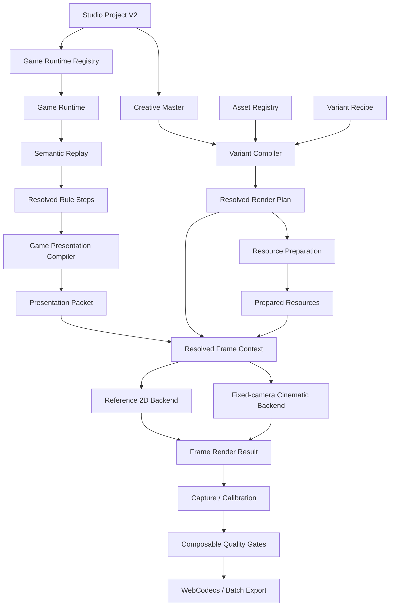

# 多游戏二维玩法真值与固定机位影视渲染系统设计 v2

- 状态：Proposed / Implementation-aligned
- 适用仓库：`dongyuan21/block-creative-studio`
- 文档版本：`2.0`
- 更新时间：2026-09-03
- 代码审计快照：
  - 默认分支：`main@fec24de6764bb50ef082730321b167cf8a29259f`
  - 最新实现分支：`cursor/next-phase-t0-t5-5d9d@526aee6c6a1ab01c005f868f555cafa81b6bbdd9`
  - 最新实现分支相对 `main`：领先 16 个提交
- 首批覆盖游戏：
  - `block-placement`：当前 Block Placement
  - `block-crush-drop`：第二款 Block Crush
  - `vita-mahjong-solitaire`：未来 Vita Mahjong 类麻将消除

> 本文以最新实现分支为事实基础，但该分支仍处于 `ready-for-review`：真实商业 Golden、真实 GPU 性能、正式 9:16 构图、材质感知破碎和人工视觉批准尚未完成。本文描述“当前事实、近期迁移和目标架构”，不把契约存在误写成能力已经上线。

---

## 1. 决策摘要

BCS 的长期产品边界定义为：

> **面向 IAA 消除类广告素材的二维玩法仿真、导演与固定机位影视渲染平台。**

其中：

- **玩法真值是二维的**：合法性、匹配、消除、移动、解锁、计分和胜负由确定性二维逻辑求解；
- **表现空间可以是三维的**：厚度、透视、PBR 材质、灯光、阴影、抬升、坍塌、碎片、粒子和景深服务于成片；
- **固定摄像机是共同的视觉边界**：系统不追求自由相机下的完整三维世界；
- **正式生产后端是固定机位影视渲染**；Reference 2D 长期保留为规则、布局、时序、素材谱系和回归证据后端；
- **两种后端共享真值和协议，不要求共享同一个 Scene 类或同一种绘制技术**；
- **Headless 编译结果是正式渲染的配置真值**；当前 `StyleSpec` 是网页创作和兼容桥，不是未来唯一运行时协议；
- **物理不能决定 Gameplay Truth**，但可以在 Presentation Truth 中提供受约束运动和自由碎片运动；
- **多游戏扩展以 Game Runtime、Slot Schema、Event Catalog、Composition Profile 和 Evidence Suite 为边界**，不以散落的 `if (gameId === ...)` 扩展。

目标流水线为：

```text
Studio Project
      ↓
Game Runtime：二维规则与 Replay
      ↓
Resolved Gameplay / Semantic Identity
      ↓
Game Presentation Compiler
      ↓
Presentation Packet
      +
Creative Master / Variant Recipe / Asset Registry
      ↓
Resolved Render Plan
      ↓
Prepared Resources
      ↓
Reference 2D Backend 或 Fixed-camera Cinematic Backend
      ↓
Frame Render Result / Capture Evidence
      ↓
Quality Gates
      ↓
WebCodecs / Batch Export
```

---

## 2. 相比 v1 的关键修正

上一版产品判断正确，但落地方式过于理想化。基于当前代码，v2 作出以下修正。

### 2.1 不再要求 Reference 2D 和 Cinematic 共用一个物理 Scene

错误表述：

```text
Reference 2D 与三维成片必须变成同一个 Scene 的不同 Profile
```

修正为：

```text
Reference 2D Backend
和
Fixed-camera Cinematic Backend

可以保持独立实现，
但必须消费同一 Gameplay Truth、Replay Identity、Presentation Packet、
实体语义、事件语义、构图契约和帧时间。
```

Canvas2D 与 Three.js 的资源生命周期、调试能力和画质目标不同，强行合并成一个 Scene 类没有价值。真正要消灭的是**两套玩法/时序真值**，而不是两个渲染实现。

### 2.2 保留 Renderer / Backend ID

`reference-2d`、`fixed-camera-cinematic` 仍然是有意义的执行后端。不能因为“逐元素可混合表达”就删除 Backend ID。

必须区分：

| 概念 | 示例 | 决定什么 |
|---|---|---|
| Gameplay topology | `grid-2d`、`layered-planar` | 规则在哪种二维结构上运行 |
| Render backend | `reference-2d`、`fixed-camera-cinematic` | 谁执行这一帧 |
| Representation | Sprite、Mesh、Flipbook、Shader | 一个元素怎样被画 |
| Device/runtime | Canvas2D、WebGL2、未来 WebGPU | 底层技术 |
| View policy | Fixed camera | 最终观察边界 |

### 2.3 不新增一套平行 Materialization 类型系统

当前代码已经形成：

```text
MaterialPackManifest
→ compileMaterialRuntime
→ MaterialRuntimeDescriptor
→ runtime texture loading
→ PBR material factory
```

新架构必须沿用该链路。后续新增的是：

- Geometry / Representation Binding；
- Material Behavior Runtime；
- Effect Runtime；
- Fragment / Debris 资源；

而不是再建立一个与 `MaterialPack` 竞争的 `MaterializationPack`。

### 2.4 以现有 Headless 帧协议为主轴

当前已经存在并应保留：

- `FrameRenderRequest`
- `PreparedResources`
- `FrameRenderResult`
- `CalibrationCase`
- `MaterialRuntimeDescriptor`
- `ResolvedRenderPlan`
- `QualityReport`

多游戏设计应扩展这些接口，而不是在另一个目录重新定义同义协议。

### 2.5 采用渐进式抽取，不进行大爆炸重写

第一阶段不重写 Block Placement，不改变现有公开视频捕获 Hash，不移动所有目录。先将现有实现包装成第一款 Game Runtime，再逐步把固定假设移出平台层。

---

## 3. 当前代码事实地图

### 3.1 已经较成熟、应直接复用的部分

| 当前模块 | 已有价值 | v2 定位 |
|---|---|---|
| `src/headless/assetRegistry.ts` | 不可变版本、Hash 校验、解析 | 平台核心 |
| `src/headless/variantCompiler.ts` | Look/Slot 解析、依赖闭包、Plan Hash、锁定模式 | 平台核心，改为 Profile 驱动 |
| `src/headless/qualityGate.ts` | 结构、预算、Hash、相机和效果门禁 | 可组合门禁引擎 |
| `src/headless/frameRequest.ts` | 冻结帧请求、帧时间、诊断视图 | 公共渲染 API |
| `src/headless/calibration.ts` | Source PTS / Target Frame 分离、Golden Case | 公共证据 API |
| `src/headless/materialRuntime.ts` | PBR 贴图、通道、色彩空间、严格解析 | 材质运行时主链 |
| Browser Asset Store | 内容寻址、Blob 与 Manifest 绑定 | 平台资源层 |
| WebCodecs + Mediabunny | 固定帧 H.264/MP4 | 平台导出层 |
| Capture Runner | 浏览器真实捕获、Hash、Seek/Abort 测试 | 公共 Evidence Runner |
| Stable Hash / RNG | 可复现身份与随机性 | 平台基础设施 |

### 3.2 已有正确接口，但仍被第一款游戏参数污染

| 当前接口 | 当前固定假设 | 应如何泛化 |
|---|---|---|
| `CreativeMaster` | `ruleProfile + board.rows/cols` | `game identity + truth identity + composition refs` |
| `REQUIRED_LOOK_SLOTS` | board/tile/placement/clear | 由 Game Render Contract 提供 |
| `CinematicEventType` | line-clear/cross-clear 等 | Namespaced Event Catalog |
| `ReferencePassId` | board/tile/tray/placement | Backend Pass Catalog |
| `coordinateMapping.ts` | 1064×1788、固定 board rect | Composition Profile |
| `CalibrationCase` 默认 ROI | board/grid/score/tray | Calibration Profile |
| `FIXED_SHOT_PROFILE` | Block Garden 单例 | 每个 Render Plan 的 Resolved Shot |
| `RuntimeAssetBindings` | background/tileFace 固定字段 | 通用 Slot Binding Map |
| Quality Gate | 清除必须有 energy/tile-exit | 事件契约提供门禁规则 |

### 3.3 仍然高度 Block Placement 专用的部分

- `src/domain/types.ts`
- `src/domain/gameEngine.ts`
- `src/domain/boardPresets.ts`
- `src/domain/shapes.ts`
- `src/director/presentationCompiler.ts`
- `src/reference2d/Reference2DScene.ts`
- `src/renderer/StudioScene.ts`
- `src/renderer/ThreeViewport.tsx`
- `src/state/useStudioModel.ts`
- `src/App.tsx`
- `src/capture/capturePlan.ts`
- `schemas/block-creative-project.schema.json`

当前这些文件共同写死了：

```text
8×8
三候选块
PlacementAction
row/col clear
Block Rhythm
board/tray/piece
draggedPiece
ClearingFrame
Block HUD
Block Capture Fixtures
```

它们不是“错误实现”，而是第一款游戏的完整 Vertical Slice。多游戏改造应把它们重新归类为 `block-placement` 实现，而不是试图将每个字段都改成万能字段。

---

## 4. 产品与支持边界

### 4.1 “二维玩法真值”的精确定义

“二维”指规则求解边界，不指渲染 API。

系统允许：

- 矩形或非矩形二维网格；
- Polyomino、单格、牌块等二维 Footprint；
- 多个二维逻辑 Surface；
- 离散层级；
- 覆盖图、邻接图、支撑图、阻塞图、匹配图；
- 规则明确给出的二维目标位置；
- 二维状态上的放置、交换、配对、移除、重排、合成和连锁。

系统不把以下内容作为 Gameplay Truth：

- 相机焦距与姿态；
- Mesh 世界坐标；
- 临时 Z 高度；
- 视觉旋转与翻滚；
- 碎片轨迹；
- 自由刚体最终落点；
- 光照、Bloom、景深和运动模糊。

### 4.2 支持的游戏

只要满足以下条件即可进入 BCS：

```text
动作合法性与最终状态
可以在二维平面、离散层或二维关系图上完整确定地求解；
固定机位三维化只负责呈现结果。
```

### 4.3 明确不支持

- 合法性依赖连续三维碰撞结果；
- 胜负依赖自由刚体堆叠后的自然位置；
- 需要自由相机寻找信息；
- 三维导航、第一/第三人称移动；
- 关卡规则必须读取渲染深度 Buffer 才能成立。

---

## 5. 四类真值与证据

### 5.1 Gameplay Truth

包含：

- Game State；
- Semantic Action；
- Rule Resolution；
- Score / Goal / Outcome；
- State Hash；
- 实体最终位置与可用性。

### 5.2 Replay Identity

现有 `studioVariantBridge` 已经隐含了两级身份，v2 将其正式化：

```text
Semantic Replay Identity
= 初始状态 + 规则动作
```

```text
Frame Replay Identity
= Semantic Identity
+ Interaction Trace
+ Director Profile
+ FPS
+ Total Frames
```

材质、背景和后处理不能改变 Semantic Replay Identity。

### 5.3 Presentation Truth

包含：

- 动作、接触、消除、移动和反馈的帧区间；
- Pointer / Selection / Ghost；
- 实体在表现空间中的确定性轨迹；
- Camera feedback；
- Effect cue；
- 音频 cue；
- Motion Bake identity。

### 5.4 Pixel / Evidence Truth

包含：

- 实际渲染 Backend；
- Plan Hash；
- Prepared Resource Hash；
- Frame Request；
- Frame Result；
- 浏览器、GPU/SwiftShader、分辨率；
- Beauty / Diagnostic 输出；
- Calibration Case 和人工 Review 状态。

必须始终区分：

```text
契约存在
≠ Plan 编译成功
≠ 资源已就绪
≠ Frame 已渲染
≠ Golden 已通过
≠ 人工视觉批准
```

---

## 6. 目标架构



### 6.1 单向依赖

```text
Game Runtime
→ Replay / Rule Resolution
→ Presentation Packet
→ Render Plan + Prepared Resources
→ Renderer Backend
→ Frame Result
→ Evidence / Export
```

禁止：

```text
Renderer → 修改 Game State
Physics → 决定最终规则位置
Canvas / Three.js → 判断动作是否合法
React State → 成为唯一玩法真值
Asset name → 隐式改变规则
```

---

## 7. Game Runtime：不要设计成万能父类

### 7.1 平台边界使用 Envelope

跨模块、持久化和 Headless API 使用稳定 Envelope，不让平台枚举每款游戏的字段。

```ts
interface GameProjectEnvelope {
  gameId: string;
  moduleVersion: string;
  rulesetId: string;
  rulesetVersion: string;

  config: {
    schemaId: string;
    data: unknown;
  };

  initialState: {
    schemaId: string;
    data: unknown;
    stateHash: string;
  };
}

interface GameReplayEnvelope {
  gameId: string;
  moduleVersion: string;
  actionSchemaId: string;
  initialStateHash: string;
  seed: number;

  actions: Array<{
    id: string;
    actor: 'human' | 'agent';
    data: unknown;
  }>;

  interactions?: InteractionRecord[];
}
```

平台负责版本、Hash 和路由；Game Runtime 负责解析 `unknown`。

### 7.2 模块内部保留强类型

```ts
interface GameRuntime<State, Action, Resolution> {
  readonly definition: GameDefinition;

  parseState(value: unknown): State;
  parseAction(value: unknown): Action;

  createInitialState(config: unknown, seed: number): State;
  stateIdentity(state: State): unknown;

  listLegalActions?(state: State): Action[];

  resolveAction(
    state: State,
    action: Action,
    context: RuleContext,
  ): Resolution;

  resolutionAfterState(resolution: Resolution): State;

  semanticReplayIdentity(
    initial: State,
    actions: Action[],
  ): unknown;
}
```

不要强制三款游戏共享一个 `GameState`、`BoardState` 或 `Action` 联合类型。

### 7.3 Game Definition

```ts
interface GameDefinition {
  id: string;
  moduleVersion: string;
  displayName: string;
  description: string;

  topology:
    | 'grid-2d'
    | 'layered-planar'
    | 'planar-graph';

  schemaRefs: {
    config: string;
    state: string;
    action: string;
    resolution: string;
  };

  renderContracts: GameRenderContractRef[];
  eventCatalogRef: AssetRef;
  defaultEvidenceSuiteRef?: AssetRef;

  capabilities: {
    cascades: boolean;
    gravity: boolean;
    discreteLayers: boolean;
    undo: boolean;
    shuffle: boolean;
    bot: boolean;
  };

  maturity:
    | 'rule-auditing'
    | 'reference-render'
    | 'cinematic-preview'
    | 'production';
}
```

Capability 只用于展示、兼容检查和 UI 入口，不用于替代规则实现。

### 7.4 Registry

一期继续使用编译期 Registry：

```ts
const GAME_RUNTIME_REGISTRY = {
  'block-placement': blockPlacementRuntime,
  'block-crush-drop': blockCrushRuntime,
  'vita-mahjong-solitaire': vitaMahjongRuntime,
};
```

动态下载执行代码、远程插件沙箱和第三方 Game Package 暂不进入本期。

---

## 8. Rule Resolution：公共 Envelope，游戏拥有 Payload

上一版试图把所有过程统一为固定 `Commit / Detect / Resolve / Move / Settle`。这些阶段适合观察和调试，但不应成为所有游戏必须填满的函数模板。

建议：

```ts
interface GameResolutionEnvelope {
  gameId: string;
  resolutionSchemaId: string;

  beforeStateHash: string;
  afterStateHash: string;
  afterState: unknown;

  phases: Array<{
    category:
      | 'commit'
      | 'detect'
      | 'resolve'
      | 'reconfigure'
      | 'settle'
      | 'outcome';
    eventIds: string[];
  }>;

  events: GameEventEnvelope[];
  entityDeltas?: EntityDelta[];
}
```

```ts
interface GameEventEnvelope {
  id: string;
  type: string;       // namespaced
  category:
    | 'interaction'
    | 'contact'
    | 'resolve'
    | 'movement'
    | 'spawn'
    | 'availability'
    | 'metric'
    | 'terminal';
  tags: string[];
  payloadSchemaId?: string;
  payload?: unknown;
}

type EntityDelta =
  | { kind: 'spawn'; entityId: string; to: LogicalPose }
  | { kind: 'move'; entityId: string; from: LogicalPose; to: LogicalPose }
  | { kind: 'remove'; entityId: string; from: LogicalPose }
  | { kind: 'availability'; entityId: string; available: boolean }
  | { kind: 'transform'; entityId: string; payload: unknown };
```

游戏可以输出更丰富的专属 Resolution；`entityDeltas` 是跨渲染、调试和质量门禁使用的公共索引，不替代专属 Payload。

事件命名示例：

```text
block-placement.piece-placed
block-placement.line-cleared

block-crush.piece-contact
block-crush.support-collapsed
block-crush.cascade-resolved

vita-mahjong.tile-selected
vita-mahjong.pair-matched
vita-mahjong.tiles-unlocked
```

---

## 9. Interaction 与 Semantic Action 分离

当前 `PlacementAction` 同时保存：

```text
pieceId + anchor
durationFrames + pointerPath
```

这会让玩法和导演耦合。

目标结构：

```ts
interface InteractionRecord {
  id: string;
  modality:
    | 'pointer'
    | 'touch'
    | 'tap'
    | 'drag'
    | 'agent-authored';

  samples?: Array<{
    frameOffset: number;
    x: number;
    y: number;
    pressure?: number;
  }>;

  intent?: string;
  committedActionId?: string;
}
```

Semantic Action 只包含规则改变：

```ts
{ type: 'place-piece', pieceId, anchor }
{ type: 'drop-piece', pieceId, lane }
{ type: 'match-pair', firstTileId, secondTileId }
{ type: 'shuffle' }
{ type: 'undo', targetActionId }
```

### 9.1 迁移方式

V1 项目暂不立即改文件格式。先由 Block Adapter 提供：

```text
legacy PlacementAction
→ semantic action identity
+ frame interaction identity
```

这与当前 `studioVariantBridge` 已经采用的 `semanticHash / frameHash` 逻辑一致。等 Adapter、测试和迁移器稳定后，再写入 Project V2。

---

## 10. Presentation Packet：两种 Backend 的共享输入

当前 `PresentationFrame` 直接包含 Block 的 `BoardState`、`draggedPiece` 和 `ClearingFrame`，不能成为多游戏公共协议。

目标公共协议：

```ts
interface PresentationPacket {
  contract: 'bcs.presentation-packet';
  version: '2.0.0';

  gameId: string;
  frameIndex: number;
  fps: number;
  totalFrames: number;

  stateHash: string;

  scene: SemanticSceneSnapshot;
  interactions: InteractionSample[];
  events: PresentationEventSample[];
  metrics: Record<string, number | string | boolean>;

  cameraFeedback: {
    punch: number;
    shakeX: number;
    shakeY: number;
    zoom: number;
  };

  gamePayload?: {
    schemaId: string;
    data: unknown;
  };
}
```

### 10.1 Semantic Scene

```ts
interface SemanticSceneSnapshot {
  entities: SemanticVisualEntity[];
  surfaces: string[];
}

interface SemanticVisualEntity {
  entityId: string;
  role: string;
  surfaceId: string;

  logicalPose: {
    u: number;
    v: number;
    layer?: number;
    rotation?: number;
  };

  footprint: unknown;
  appearanceSlots: Record<string, string>;
  tags: string[];
  visibility: 'visible' | 'hidden' | 'ghost';
}
```

两种 Backend 共享该 Packet，但允许各自有 Backend Adapter：

```text
Block Presentation Packet
→ Block Reference Adapter → Canvas2D
→ Block Cinematic Adapter → Three.js
```

长期可以复用更多 Scene 编译代码，但“共享输入协议”优先于“共享 Scene 实现”。

---

## 11. Renderer Backend：保留两个正式职责

### 11.1 Reference 2D Backend

长期职责：

- 规则和状态可视化；
- 布局与屏幕坐标标定；
- 原始参考风格复刻；
- Pass 隔离；
- Native Design Resolution Capture；
- Golden Diff；
- 快速、确定、低成本诊断。

它不是最终用户必须选择的“另一种产品方向”，而是平台内部的标准答案与证据后端。

### 11.2 Fixed-camera Cinematic Backend

长期职责：

- 固定机位；
- 浅 3D / 真 3D 几何；
- PBR 材质；
- 灯光、阴影、环境反射；
- 动力学、碎片、粒子；
- 后处理；
- 正式 9:16 投放视频。

### 11.3 `three-3d`

当前作为遗留实验/自由构图预览存在。目标状态：

```text
reference-2d              正式诊断后端
fixed-camera-cinematic    正式生产后端
three-3d                  legacy / sandbox，逐步退出主流程
```

### 11.4 Backend 协议

现有 `src/extensions/contracts.ts` 的 `RendererBackend` 依赖 Block `PresentationFrame` 和 `StyleSpec`。应迁移为 Headless Core 的正式接口：

```ts
interface RenderBackend {
  readonly id: string;

  capabilities(): RenderBackendCapabilities;

  prepare(
    plan: ResolvedRenderPlan,
    resources: PreparedResources,
  ): Promise<PreparedRenderContext>;

  renderFrame(
    request: FrameRenderRequest,
    frame: PresentationPacket,
    context: PreparedRenderContext,
  ): Promise<FrameRenderResult>;

  dispose(context: PreparedRenderContext): void;
}
```

---

## 12. Composition、Layout、Camera 与 Shot 必须分开

当前代码把 1064×1788、1080×1920、Block 棋盘 Rect 和固定 Shot 单例混在多个文件中。多游戏以后应拆成四层。

### 12.1 Composition Profile

定义画布和输出映射：

```ts
interface CompositionProfile {
  id: string;

  designResolution: {
    width: number;
    height: number;
  };

  defaultOutput: {
    width: number;
    height: number;
    fps: number;
  };

  mapping:
    | { mode: 'native' }
    | { mode: 'contain'; background: string }
    | { mode: 'cover'; cropPolicy: string };

  safeAreas: Record<string, ScreenRect>;
}
```

`containMapping` 是通用数学，应保留；`DESIGN_RESOLUTION` 和 `DESIGN_BOARD_OUTER` 不应继续作为全局产品常量。

### 12.2 Layout Profile

定义语义区域：

```ts
interface LayoutProfile {
  id: string;
  compositionProfileRef: AssetRef;

  surfaces: Record<string, {
    screenRect?: ScreenRect;
    screenQuad?: [Point2, Point2, Point2, Point2];
    logicalBounds?: { width: number; height: number };
    zOrder: number;
  }>;
}
```

示例 Surface：

```text
background
playfield
candidate-tray
candidate-side-queue
mahjong-stack
hud-top
hud-side
feedback-overlay
foreground-frame
```

### 12.3 Camera Profile

只描述固定摄像机本身：

```ts
interface FixedCameraProfile {
  id: string;
  projection: 'orthographic' | 'perspective' | 'calibration-pending';
  pose: CameraPose;
  lens?: LensSpec;

  allowOrbit: false;
  allowLensAnimation: false;

  feedbackLimits: {
    maximumZoom: number;
    maximumTranslationPx: number;
    maximumRotationDegrees: number;
  };
}
```

### 12.4 Resolved Shot Profile

由以下内容编译而来：

```text
Composition Profile
+ Layout Profile
+ Camera Profile
+ Renderer capability
→ Resolved Shot Profile
```

它是 Render Plan 的派生结果，不应继续是 `FIXED_SHOT_PROFILE` 全局单例。

---

## 13. Slot Schema：LookPack 保持开放，必选槽按游戏和后端解析

当前 `LookPackManifest.slots` 已经是开放 Record，这是正确的；问题在于 `REQUIRED_LOOK_SLOTS` 是全局 Block 清单。

目标：

```ts
interface GameRenderContract {
  id: string;
  gameId: string;
  backendId: string;

  requiredSlots: SlotRequirement[];
  optionalSlots: SlotRequirement[];

  passCatalogRef: AssetRef;
  eventCatalogRef: AssetRef;
  calibrationProfileRef: AssetRef;
}

interface SlotRequirement {
  slotId: string;
  acceptedKinds: AssetKind[];
  required: boolean;
  fallbackPolicy: 'forbid' | 'builtin' | 'diagnostic-only';
  semanticRole: string;
}
```

### 13.1 Block Placement 示例

```text
background.base
playfield.skin
block.body.material
block.body.geometry
block.face
interaction.drag-preview
placement.confirmation
resolve.line-clear
hud.score
feedback.combo
endgame.presentation
```

### 13.2 Block Crush 示例

```text
background.base
playfield.skin
block.body.material
block.body.geometry
drop.preview
contact.impact
resolve.crush
movement.collapse
debris.large
debris.small
hud.level
hud.score
hud.timer
```

### 13.3 Vita Mahjong 示例

```text
background.base
mahjong.table
mahjong.tile.body
mahjong.tile.face-pack
mahjong.tile.edge
interaction.selection
interaction.invalid
resolve.pair-exit
availability.unlock
hud.score
hud.hint
hud.shuffle
hud.undo
endgame.clear-board
```

Variant Compiler 不再导入一个全局常量，而是接收编译后的 `GameRenderContract`。

---

## 14. Event Catalog 与 Effect Contract

当前 `CinematicEventType` 是第一款游戏闭集。目标为：

```ts
interface EventCatalog {
  gameId: string;
  events: Array<{
    type: string;
    category: GameEventEnvelope['category'];
    tags: string[];
    payloadSchemaId?: string;
    effectRequirements?: EffectRequirement[];
  }>;
}

interface EffectRequirement {
  role:
    | 'anticipation'
    | 'energy'
    | 'material-response'
    | 'entity-exit'
    | 'large-fragments'
    | 'small-fragments'
    | 'particles'
    | 'lighting-reaction'
    | 'screen-feedback'
    | 'audio';

  required: boolean;
}
```

Effect Pack 支持两种绑定：

```text
精确事件：block-placement.line-cleared
通用选择：category=resolve + tags includes brittle
```

当前 `effect.universal-clear` 可保留为兼容资源，但不应成为所有消除游戏的最终语义模型。

---

## 15. 材质、几何、牌面和破坏行为

### 15.1 保留当前材质主链

```text
MaterialPackManifest.appearance
→ MaterialRuntimeDescriptor
→ RuntimeTextureSet
→ Backend Material Factory
```

已有能力包括：

- Albedo / Normal / Roughness / Metallic / AO / Emission / ORM；
- sRGB / Linear 校验；
- OpenGL / DirectX normal Y；
- Hash 和 URI 校验；
- `replace` 与 `multiply-factor`；
- Texture Resource Key 与 Descriptor Key 分离；
- 加载失败时阻止正式导出。

这些能力直接复用到三款游戏。

### 15.2 新增 Representation Binding，而不是替换 MaterialPack

```ts
interface RepresentationBinding {
  semanticRole: string;

  representation:
    | 'canvas-recipe'
    | 'sprite'
    | 'relightable-card'
    | 'extruded-proxy'
    | 'instanced-mesh'
    | 'mesh'
    | 'flipbook'
    | 'procedural-shader'
    | 'baked-fixed-view';

  geometryRef?: AssetRef;
  materialRef?: AssetRef;
  faceRef?: AssetRef;
  effectRef?: AssetRef;

  fallbackOrder?: RepresentationBinding['representation'][];
}
```

### 15.3 Material Behavior Runtime

当前 `MaterialBehaviorProfile` 已有材质行为参数，但运行时仍标记 `behaviorPending` 和 `materialAwareFracture: pending`。下一阶段新增：

```text
MaterialPack.behavior
→ MaterialBehaviorRuntime
→ Effect/Fragment parameterization
```

不能在能力完成前把它写成“已支持材质感知破碎”。

### 15.4 Vita Mahjong 的 Face 与 Body 必须分离

```text
matchKey         规则身份
faceId           视觉牌面身份
tile.body        厚度、倒角、材质
tile.face        高可读贴花/纹理
tile.edge        边缘与装饰
```

换牌体材质不能改变 `matchKey`。换 Face Pack 时，必须显式提供：

```text
matchKey → face asset
```

---

## 16. Prepared Resources：统一正式渲染前的资源门禁

当前资源就绪分散在：

- `PreparedResources`
- Browser Asset Bindings
- `MaterialRuntimeStatus`
- Scene 内部图片/纹理解码状态

目标是让正式导出只依赖一个聚合结果：

```ts
interface PreparedRenderResources extends PreparedResources {
  backendId: string;
  planHash: string;

  materialDescriptors: Record<string, MaterialRuntimeDescriptor>;
  slotBindings: Record<string, PreparedResourceSlot>;

  diagnostics: Array<{
    subsystem: 'asset' | 'material' | 'geometry' | 'effect' | 'font' | 'audio';
    state: 'ready' | 'failed' | 'stale';
    message?: string;
  }>;
}
```

规则：

- 新资源未提交时可以继续显示上一套完整画面；
- 但状态必须是 `stale`；
- `stale / failed / missing` 均禁止正式导出；
- Preview fallback 与 Authoritative Capture 必须明确分开；
- Plan Hash、Descriptor Key 和资源 Hash 必须进入证据记录。

---

## 17. Pass Catalog：区分公共阶段和游戏子 Pass

当前 Reference Pass：

```text
background / board / tile / tray / interaction /
placement / clear / feedback / endgame
```

适合作为 Block Reference Backend 的 v1 Pass Catalog，不适合作为平台全局枚举。

### 17.1 平台阶段

```text
environment
playfield
stable-entities
transient-entities
material-response
debris
world-feedback
screen-ui
postprocess
diagnostic
audio
```

### 17.2 Backend / Game 子 Pass

例如 Vita Mahjong：

```text
mahjong.table
mahjong.stable-tiles
mahjong.selected-tile
mahjong.pair-exit
mahjong.unlock-feedback
mahjong.hud
```

`FrameRenderRequest.enabledPasses` 在 v2 中使用字符串 ID，并由目标 Backend 的 Pass Catalog 校验顺序与合法性。

### 17.3 迁移原则

现有 `Reference2DScene` 仍可继续使用条件分支。先把 Pass Catalog 数据化，再按收益拆独立模块；不要为了目录美观先重写绘制代码。

---

## 18. Cinematic Dynamics 与物理边界

### 18.1 Motion Authority

```ts
type MotionAuthority =
  | 'logical-kinematic'
  | 'directed-motion'
  | 'target-constrained-physics'
  | 'free-physics'
  | 'baked-transform';
```

| 对象 | Authority | 说明 |
|---|---|---|
| 稳定逻辑实体 | logical-kinematic | 精确锁定规则位置 |
| 拖拽、选中、投放 | directed-motion | 导演可控 |
| 有最终规则位置的幸存实体 | target-constrained-physics | 局部自然、最终收敛 |
| 已被规则移除的完整块/大碎片 | free-physics | 不影响后续玩法 |
| 正式输出 | baked-transform | 可 Seek、可重现 |

### 18.2 当前事实

当前 Three.js 清除碎片主要是 Seed 驱动的确定性解析轨迹，不是刚体系统；材质感知破碎仍处于 pending。v2 不要求先引入物理引擎，优先建立：

```text
Motion Track Contract
→ Deterministic Evaluator
→ Optional Physics Adapter
→ Motion Bake
```

### 18.3 Block Placement

- 拖拽：导演轨迹；
- 放置：短时压缩、回弹；
- 幸存块：逻辑锁定，可有小幅次级震动；
- 被清除块和碎片：自由或解析运动；
- 最终棋盘完全由二维规则决定。

### 18.4 Block Crush

- 宏观拱形、翻卷和传播：Spline / Wave Field；
- 幸存块：目标约束运动；
- 被移除块和大碎片：自由物理；
- 木屑、粉尘：粒子/Flipbook；
- 最终位置来自二维 Collapse Resolution；
- 正式渲染前烘焙。

### 18.5 Vita Mahjong

- 选中牌：轻微抬升、倾斜、阴影；
- 合法配对：合拢、飞出、消散或轻碎裂；
- 新解锁牌：边缘/光照反馈；
- 剩余牌不因表现层物理改变逻辑位置；
- Availability 由阻塞图重新计算。

---

## 19. Calibration 与 Evidence Suite

### 19.1 保留 CalibrationCase

以下设计已经正确，应继续作为公共协议：

- `sourceFrameIndex`
- `sourcePtsSeconds`
- `targetFrame`
- `targetFps`
- `exact-replay / state-matched / isolated-presentation`
- `PASS / FAIL / BLOCKED / NOT_COMPARABLE / NOT_RUN`

### 19.2 移出全局常量的内容

以下内容必须进入 Profile：

- Design Resolution；
- ROI；
- excludedRegions；
- 事件锚点；
- 可比较的 Diagnostic View；
- 允许误差；
- 目标 Backend。

```ts
interface CalibrationProfile {
  id: string;
  gameId: string;
  layoutProfileRef: AssetRef;

  rois: Array<{
    id: string;
    semanticRole: string;
    rect: ScreenRect;
    required: boolean;
  }>;

  defaultExcludedRegions: ScreenRect[];
  metrics: CalibrationMetricPolicy[];
}
```

### 19.3 Game Evidence Suite

```ts
interface GameEvidenceSuite {
  gameId: string;
  version: string;

  fixtures: EvidenceFixture[];
  captureCases: CaptureCaseSpec[];
  goldenCases: CalibrationCase[];
  unresolvedRules: string[];
}
```

Capture Runner 保持平台通用；每款游戏贡献数据。

推荐产物路径：

```text
review-package/run/<game-id>/<ruleset-id>/
├── frames/
├── videos/
├── diagnostics/
└── reports/
```

### 19.4 证据等级

- `observed`：从参考录屏重复直接观察；
- `inferred`：多处现象支持，但未直接证明；
- `unresolved`：信息不足，禁止写入正式规则；
- `synthetic-fixture`：人为构造的工程测试，不冒充商业 Golden。

---

## 20. Quality Gates 采用组合模型

### 20.1 Platform Gates

- Contract / Schema；
- Content Hash；
- Dependency closure；
- Determinism；
- Resource readiness；
- Output dimensions / FPS；
- 预算；
- 禁止权限；
- Plan Hash。

### 20.2 Game Gates

由 Game Runtime 提供：

```text
动作合法性
State Hash
Resolution invariants
Outcome
Undo / Shuffle / Cascade 一致性
```

### 20.3 Render Contract Gates

由 `GameRenderContract` 提供：

- 必选 Slot；
- Asset Kind；
- Backend capability；
- Event → Effect layer requirement；
- Surface / Camera / Composition 一致性。

### 20.4 Evidence Gates

- Frame Request 可重放；
- 相同 Frame Hash 产生相同输出 Hash；
- Source/Target 时间对应；
- Golden Case 状态；
- Backend / Browser / GPU 记录；
- Authoritative Capture 不得静默 fallback。

### 20.5 Perceptual Gates

后续逐步加入：

- 材质辨识度；
- 高光截断；
- 牌面可读性；
- 核心实体遮挡；
- Motion endpoint；
- 闪烁；
- Depth sorting；
- Safe Area；
- 压缩伪影。

---

## 21. 三款游戏的规则与视觉模型

### 21.1 Block Placement

#### Gameplay

```text
grid-2d
+ polyomino candidates
+ place-piece
+ full-row/full-column detection
+ synchronized remove
+ candidate refresh
```

#### 当前迁移

现有 `domain/*`、`presentationCompiler`、两个 Scene 和 Capture Fixtures 首先整体归属 `block-placement`，由 Adapter 暴露新接口。不要先改算法。

#### Cinematic

- 抬起与拖拽；
- 合法/非法预览；
- 接触与回弹；
- 行列传播；
- 材质相关碎片；
- Praise / Combo；
- 固定机位输出。

### 21.2 Block Crush

#### Gameplay

```text
grid-2d
+ drop action
+ contact / structure detection
+ remove
+ support/gravity reconfiguration
+ cascade
+ settle
```

必须建立持久 `entityId`，并输出每个幸存实体的 `from → to`。

#### Cinematic

- 落块加速度与接触压缩；
- 冲击传播；
- Spline/Wave 宏观坍塌；
- 受约束幸存块；
- 自由碎块、木屑和粉尘；
- 最终与二维目标格精确对齐。

#### 未验证项

仅凭样片不能写死：

- 精确触发规则；
- 支撑算法；
- 坍塌顺序；
- 候选补充；
- 分数与时间；
- Cascade 条件。

### 21.3 Vita Mahjong

#### Gameplay topology

Vita Mahjong 不应被建模为普通二维数组，而是：

```text
二维平面坐标
+ 离散 layer
+ tile footprint
+ overlap graph
+ left/right blocking
+ match relation
```

示例：

```ts
interface MahjongTileEntity {
  id: string;
  faceId: string;
  matchKey: string;

  footprint: {
    x: number;
    y: number;
    width: number;
    height: number;
  };

  layer: number;
  removed: boolean;
}
```

`matchKey` 与 `faceId` 必须分离。

#### Semantic Actions

```text
select-tile       可能只属于 Interaction
match-pair        改变玩法状态
hint              可能只改提示，也可能有规则成本
shuffle           改变布局与 Seed
undo              回退到目标规则步骤
```

真实行为必须通过目标版本录屏验证。

#### Cinematic

- 牌体厚度、倒角和接触阴影；
- Face Decal 保持高可读性；
- 选中抬升；
- 匹配牌合拢/飞出；
- 下层牌解锁反馈；
- HUD 保持屏幕空间清晰；
- 不用自由刚体决定可选牌。

### 21.4 Vita Mahjong 公开资料与证据边界

本设计只将公开资料能够确认的核心玩法写入架构假设：

- Vita Studio 官网：<https://www.vitastudio.ai/>
- Google Play：<https://play.google.com/store/apps/details?id=com.vitastudio.mahjong>
- Apple App Store：<https://apps.apple.com/us/app/vita-mahjong/id6468921495>

公开描述可以支持“配对可用的相同牌并逐步清空牌局”、大牌面、Hint、Undo 和离线游玩等产品特征，但不能替代目标版本的逐帧规则审计。以下内容继续保持 `unresolved`：

- 可用牌的精确阻塞判定；
- 花牌、季节牌或主题牌的 match group；
- 顶部槽位/容器的真实规则；
- Combo、计分与错误选择惩罚；
- Shuffle、Undo、Hint 对 Seed、Replay 和状态的影响；
- Daily Challenge、活动关卡或版本差异。

---

## 22. Studio Shell 与 Game Studio Controller

当前 `useStudioModel` 同时负责：

- Block 规则；
- Block Setup Editor；
- 人类录制；
- Agent 试玩；
- Timeline；
- Style；
- Variant；
- Material readiness；
- Export；
- Project import/export。

目标拆分：

```text
useStudioSession
├── project lifecycle
├── mode / selection
├── timeline transport
├── variant workspace
├── render/export
└── active GameStudioController
```

```ts
interface GameStudioController {
  gameId: string;

  getStatusSummary(): StudioMetric[];
  getSetupEditorModel(): unknown;
  getInteractionController(): unknown;

  createInitialReplay(): GameReplayEnvelope;
  compilePresentation(replay: GameReplayEnvelope): CompiledPresentation;

  createAgentReplay?(): GameReplayEnvelope;
}
```

### 22.1 App Shell 复用

- Toolbar；
- Game / Project identity；
- Timeline；
- Variant Workspace；
- Asset Browser；
- Render status；
- Quality report；
- Export；
- Evidence panel。

### 22.2 游戏贡献

- Setup Editor；
- Interaction Controller；
- 状态指标；
- 专属 Inspector；
- 规则 Overlay；
- Bot；
- Fixture / Evidence Suite。

React 不直接 import `GridCell`、`PieceInstance` 或 `MahjongTileEntity` 到公共 App Shell。

---

## 23. Project V2 与 Creative Master vNext

### 23.1 Studio Project V2

```ts
interface StudioProjectV2 {
  format: 'bcs-studio-project';
  version: '2.0.0';

  id: string;
  name: string;

  game: GameProjectEnvelope;

  authoring: {
    activeReplayId?: string;
    directorProfileRef: AssetRef;
    compositionProfileRef: AssetRef;
    layoutProfileRef: AssetRef;
    cameraProfileRef: AssetRef;
    lookPackRef: AssetRef;
    output: OutputSpec;
  };

  replays: GameReplayEnvelope[];
}
```

### 23.2 Creative Master vNext

Creative Master 是编译后的不可变生产事实，不是编辑器内部全部状态。

```ts
interface CreativeMasterV2 {
  contract: 'bcs.creative-master';
  contractVersion: '2.0.0';

  id: string;

  game: {
    gameId: string;
    moduleVersion: string;
    rulesetId: string;
    rulesetVersion: string;
    configHash: string;
  };

  truth: {
    initialStateHash: string;
    semanticReplayHash: string;
    finalStateHash: string;
    presentationHash?: string;
  };

  compositionProfileRef: AssetRef;
  layoutProfileRef: AssetRef;
  cameraProfileRef: AssetRef;
  renderContractRef: AssetRef;

  baseOutput: OutputSpec;
}
```

### 23.3 Lock Mode

- `frame-exact`：Semantic、Presentation、FPS、总帧数和固定视图不变，仅换视觉/音频；
- `semantic`：Gameplay Truth 与事件顺序不变，允许导演时间变化；
- `rule-only`：规则与合法性不变，可产生新 Replay、导演和时长。

### 23.4 V1 兼容

```text
block-creative-studio-project@1.0.0
→ BlockPlacementLegacyAdapter
→ StudioProjectV2 in memory
```

在 V2 导入、导出和回归测试稳定前，不立即删除 V1 parser/schema。

---

## 24. Export 与 Capture 解耦

当前 `offlineVideoExporter` 直接 import：

- Block `compileTake`；
- Block `evaluateCompiledTake`；
- `Reference2DScene`；
- `StudioScene`。

目标：

```ts
interface FrameSource {
  fps: number;
  totalFrames: number;
  frameAt(index: number): PresentationPacket;
}

interface RenderStage {
  prepare(plan: ResolvedRenderPlan): Promise<PreparedRenderResources>;
  render(request: FrameRenderRequest, frame: PresentationPacket): Promise<HTMLCanvasElement>;
  dispose(): void;
}
```

Exporter 只负责：

```text
FrameSource
→ RenderStage
→ Composition Blit
→ CanvasSource
→ H.264 / MP4
```

Capture Runner 使用同一 FrameSource/RenderStage，不再维护另一套渲染路径。

---

## 25. 对两个现有 Scene 的渐进式拆分

### 25.1 不先做“单 Scene 重写”

先抽取可复用基础设施。

#### `Reference2DScene`

建议顺序：

```text
NativeCaptureHost
PassCatalog
ResourceReadiness
BlockReferencePainter
BlockReferencePicking
```

#### `StudioScene`

建议顺序：

```text
ThreeRenderHost
FixedViewController
MaterialRuntimeAdapter
BlockCinematicSceneAdapter
EffectRuntime
HudSpriteLayer
PickingAdapter
```

两边先改成接收 `PresentationPacket`，再评估哪些 Scene Compiler 可以共享。

### 25.2 现有清除 FX

当前 `updateFx` 中的 Seed、碎片和粒子公式可迁入第一版 `BlockClearEffectRuntime`。迁移前后相同 Fixture 必须保持帧 Hash 或在明确批准的视觉变更下更新 Golden。

---

## 26. 推荐目录

```text
src/
├── platform/
│   ├── game-runtime/
│   │   ├── contracts.ts
│   │   ├── registry.ts
│   │   └── envelopes.ts
│   ├── presentation/
│   │   ├── packet.ts
│   │   ├── frameSource.ts
│   │   └── motionTracks.ts
│   ├── composition/
│   │   ├── profiles.ts
│   │   ├── mapping.ts
│   │   └── resolvedShot.ts
│   ├── rendering/
│   │   ├── backend.ts
│   │   ├── preparation.ts
│   │   └── passCatalog.ts
│   ├── evidence/
│   │   ├── calibration.ts
│   │   ├── captureRunner.ts
│   │   └── qualityGates.ts
│   └── studio/
│       ├── useStudioSession.ts
│       └── StudioShell.tsx
│
├── games/
│   ├── block-placement/
│   │   ├── runtime/
│   │   ├── presentation/
│   │   ├── studio/
│   │   ├── reference2d/
│   │   ├── cinematic/
│   │   └── evidence/
│   ├── block-crush-drop/
│   └── vita-mahjong-solitaire/
│
├── headless/
│   ├── contracts.ts
│   ├── assetRegistry.ts
│   ├── variantCompiler.ts
│   ├── materialRuntime.ts
│   └── qualityGate.ts
│
├── renderer/
│   ├── reference2d/
│   └── fixed-camera-cinematic/
│
└── exporter/
```

不要求第一阶段移动所有文件；可以先用 Re-export 和 Adapter 建立边界。

---

## 27. 当前文件到目标职责的迁移表

| 当前文件 | 近期动作 | 长期职责 |
|---|---|---|
| `domain/gameEngine.ts` | 原样包装 | `games/block-placement/runtime` |
| `domain/types.ts` | 分离平台/Block 类型 | Block 专属类型 + 临时兼容导出 |
| `director/presentationCompiler.ts` | 包装为 Block compiler | `games/block-placement/presentation` |
| `reference2d/Reference2DScene.ts` | 接受 Adapter/Packet | Reference Backend + Block Painter |
| `renderer/StudioScene.ts` | 抽 Host/Material/Effect | Fixed-camera Backend + Block Adapter |
| `renderer/shotProfile.ts` | 抽通用数学 | Resolved Shot compiler |
| `headless/coordinateMapping.ts` | 保留 contain math | Composition Profile runtime |
| `headless/calibration.ts` | 默认 ROI 参数化 | 通用 Calibration engine |
| `headless/contracts.ts` | 增量扩展 v2 | 唯一 Headless 公共类型系统 |
| `headless/variantCompiler.ts` | 注入 Render Contract | 通用 Plan compiler |
| `headless/qualityGate.ts` | 门禁注册机制 | Platform + Game + Backend gates |
| `integration/studioAssetCatalog.ts` | 标记兼容桥 | Game Slot/Style authoring adapter |
| `integration/studioVariantBridge.ts` | Game identity 策略化 | Studio → Creative Master compiler |
| `state/useStudioModel.ts` | 抽 Session / Controller | 公共 Studio session |
| `capture/capturePlan.ts` | 迁入 Block Evidence Suite | Game fixture contribution |
| `capture/browserCaptureApp.ts` | 数据驱动 | 公共 Capture Runner |
| `exporter/offlineVideoExporter.ts` | 注入 FrameSource/Stage | 通用编码器 |
| `App.tsx` | 去除 Block 类型依赖 | Studio Shell |
| Project JSON Schema | 保留 V1 + 新增 V2 | 版本化项目 Envelope |

---

## 28. 分阶段实施计划

### Phase 0：确定基线并合并现有 T0–T5

目标：

- 先完成当前实现分支 Review；
- 不把 SwiftShader 捕获当作真实 GPU 结论；
- 不把 synthetic fixture 当作商业 Golden；
- 明确哪些 commit 进入下一阶段基线。

门禁：

```text
npm run check
npm test
npm run typecheck
npm run build
npm run capture:review
```

### Phase 1：包装第一款 Game Runtime，不改行为

新增：

- `GameDefinition`
- `GameRuntimeRegistry`
- `GameProjectEnvelope`
- `BlockPlacementLegacyRuntime`
- `BlockPlacementLegacyPresentationAdapter`

不改变：

- V1 项目格式；
- Game Engine 算法；
- `PresentationFrame`；
- 两个 Scene；
- Capture Fixture；
- MP4 导出结果。

验收：

- 现有 113+ tests 通过；
- Public Fixture identity 不变；
- Semantic Hash / Frame Hash 不变；
- Capture 的重复 Seek 结果不变。

### Phase 2：Profile 驱动 Headless Compiler

新增：

- `GameRenderContract`
- `SlotRequirement`
- `EventCatalog`
- `CompositionProfile`
- `CalibrationProfile`
- Resolved Shot compiler。

改造：

- `REQUIRED_LOOK_SLOTS` 由参数提供；
- Quality Gate 可组合；
- Global Design/Board 常量迁入 Block Profile；
- `FIXED_SHOT_PROFILE` 变为第一款 Profile 数据。

验收：

- Block Plan Hash 在版本迁移规则下可解释；
- 缺 Slot、错 Asset Kind、错 Camera/Profile 能精确报错；
- Vita Mahjong Slot Schema 可以在没有实现 Renderer 的情况下通过 Schema 校验。

### Phase 3：通用 FrameSource、Preparation 与 RenderBackend

新增：

- `PresentationPacket`
- `FrameSource`
- `RenderBackend`
- `PreparedRenderResources`
- `RenderStageFactory`

改造：

- Exporter 不再 import Block compiler；
- Capture Runner 不再直接实例化游戏 Scene；
- Material Runtime Status 汇入 Prepared Resources；
- Reference/Cinematic Backend 保持独立。

验收：

- 相同 Frame Request 可重复；
- Preview fallback 与 Authoritative capture 明确；
- 任一资源 stale/failed 均阻止正式导出；
- 两种 Backend 的 State Hash / Event IDs 一致。

### Phase 4：拆 Scene 基础设施

改造：

- `StudioScene` 抽 ThreeRenderHost、FixedView、Material、Effect；
- `Reference2DScene` 抽 NativeCaptureHost、Pass Catalog、Block Painter；
- Picking 通过 Game Interaction Adapter；
- `StyleSpec` 逐步降级为兼容 DTO。

验收：

- Block 玩法无变化；
- Pass isolation 继续有效；
- Material descriptor 修改不会被跳过；
- Letterbox 外点击不产生命中；
- Fixed camera composition 不漂移。

### Phase 5：接入 Block Crush

顺序：

```text
规则证据
→ Game Runtime
→ Diagnostic Reference
→ Presentation Packet
→ Fixed-camera Cinematic
→ Dynamics / Optional Physics
→ Evidence Suite
```

不得先做一个“看起来像”的三维坍塌，再补规则。

### Phase 6：接入 Vita Mahjong

顺序：

```text
目标版本录屏
→ Layered Planar Layout
→ Blocking / Availability
→ Pair Matching
→ Hint/Shuffle/Undo 证据
→ Reference Backend
→ Fixed-camera Tile Rendering
→ Evidence Suite
```

### Phase 7：游戏市场与 Agent 批量生产

在前两款新游戏通过生产门禁后，再开放：

- Game Catalog；
- 创建项目先选 Game；
- 批量 Variant；
- 外部 Agent 通过 Headless API 生产；
- DCC 资产工厂接入；
- 跨游戏统一 KPI / QA 报告。

---

## 29. 每阶段不可回归的核心门禁

### 29.1 Gameplay

- 相同 Project + Seed + Replay 得到相同 State Hash；
- Backend、材质、背景、后处理不能改变规则；
- 每一步 Resolution 可重放；
- Game-specific invariants 通过。

### 29.2 Presentation

- 相同 Frame Identity 可 Seek；
- Semantic Event 顺序一致；
- Motion endpoint 与规则结果一致；
- Frame-exact Variant 不改变帧数与帧位。

### 29.3 Rendering

- Plan 编译成功；
- Prepared Resources 全部 ready；
- Authoritative Capture 无 fallback；
- Fixed camera / composition 一致；
- Diagnostic view 诚实标明是 Proxy 还是实际 Buffer。

### 29.4 Evidence

- Artifact 有 Hash；
- Browser / Renderer 信息可追踪；
- Synthetic / Golden 不混淆；
- 人工视觉批准单独记录；
- 商业 Golden 缺失时状态必须是 BLOCKED。

---

## 30. 明确的反模式

禁止以下实现：

```text
在公共 App / Exporter / Headless Core 中散落 gameId switch
```

```text
建立一个包含三款游戏所有字段的 UniversalGameState
```

```text
把所有游戏强制塞入二维数组
```

```text
删除 Backend ID，假装所有绘制都由一个 Scene 完成
```

```text
再建立一套与 MaterialPack / MaterialRuntime 平行的材质协议
```

```text
把 StyleSpec 当作长期 Headless 真值
```

```text
让自由刚体决定幸存实体最终位置
```

```text
把 Preview fallback 截图当作 Authoritative Golden
```

```text
把契约、测试通过或 SwiftShader 捕获称为视觉质量已经批准
```

---

## 31. 最终架构判断

BCS 不需要成为通用二维引擎，也不需要成为通用三维引擎。

它应该成为一条垂直而稳定的生产系统：

```text
多种二维消除拓扑
+ 确定性规则与 Replay
+ 可导演的 Presentation
+ 固定摄像机空间化
+ 资产和材质编译
+ 独立但同真值的 Reference / Cinematic Backend
+ 可审计的逐帧捕获
+ 高质量投放视频
```

最重要的边界是：

1. **第一款 Block、Block Crush 和 Vita Mahjong 都是独立 Game Runtime。**
2. **Headless Core、Variant Compiler、Material Runtime、Frame Request、Capture 和 Export 是平台公共能力。**
3. **Reference 2D 与固定机位影视渲染共享真值，不强求共享绘制实现。**
4. **固定摄像机是产品约束，也是提高画质、降低三维资产成本的核心优势。**
5. **当前代码应通过 Adapter 渐进迁移；先保护已经建立的测试、捕获和材质链，再扩展第二款游戏。**

第一项实施工作不是开发 Block Crush Scene，而是：

> **将当前 Block Placement Vertical Slice 包装为第一款正式 Game Runtime，同时让 Slot、Composition、Calibration 和 Capture 从全局 Block 常量变成 Profile。**
