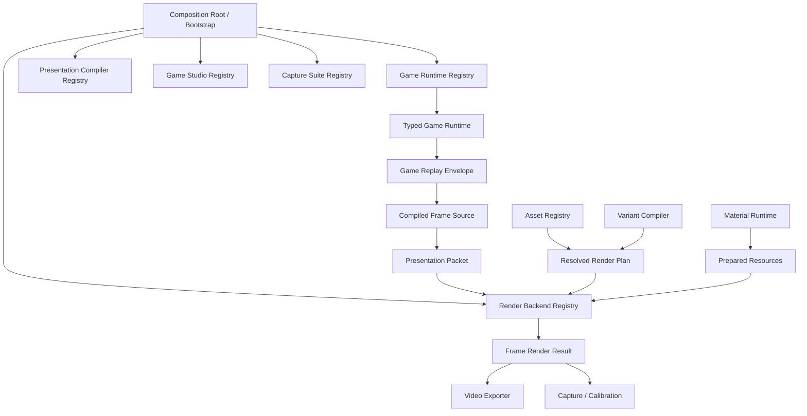

# 多游戏重构执行方案 v1

- 状态：Ready for implementation
- 适用仓库：`dongyuan21/block-creative-studio`
- 方案日期：2026-09-03
- 架构依据：`docs/architecture/MULTI_GAME_FIXED_VIEW_SYSTEM_DESIGN_V2.md`
- 代码审计基线：`cursor/next-phase-t0-t5-5d9d@526aee6c6a1ab01c005f868f555cafa81b6bbdd9`
- 当前默认分支：`main@fec24de6764bb50ef082730321b167cf8a29259f`
- 前置实现 PR：`#1 T0–T5 next phase`，当前为 Draft
- 本方案目标：在不破坏当前 Block Placement、PBR 材质、Capture、Golden、Variant 和 WebCodecs 链路的前提下，把仓库改造成可接入 Block Crush 与 Vita Mahjong 的多游戏平台。

> 本方案是一份代码执行计划，不是“未来理想架构”说明。每个重构 PR 都规定了修改范围、禁止事项、兼容路径、测试和回滚点。实现时不得把多个阶段合并成一次大爆炸重写。

---

## 1. 开工结论

### 1.1 从哪个代码版本开始

重构代码必须从以下 SHA 创建堆叠分支：

```text
526aee6c6a1ab01c005f868f555cafa81b6bbdd9
```

原因：该分支已经包含 Frame Request、Calibration、Material Runtime、固定 Shot、PBR 资源加载、Capture Runner、资源就绪门禁和相关测试。若从当前 `main@fec24de` 开工，会绕开 16 个已经完成并通过 CI 的提交，后续必然产生大规模重复开发和冲突。

推荐命令：

```bash
git fetch origin

git switch --detach 526aee6c6a1ab01c005f868f555cafa81b6bbdd9
git switch -c refactor/r0-architecture-guard
```

不要直接在 `cursor/next-phase-t0-t5-5d9d` 上继续提交。该分支承担 PR #1 的 Review 和证据绑定，必须保持可复核。

### 1.2 PR #1 未合并时是否可以写代码

可以采用 Stacked PR 开发，但必须满足：

```text
PR #1
  ↓
R0
  ↓
R1
  ↓
R2 ...
```

在 PR #1 合入前，后续 PR 的 base 指向前一个堆叠分支；PR #1 合入后，再依次 rebase/retarget 到 `main`。

基础契约和 Adapter 重构不需要等待商业 Golden 或人工视觉批准，但任何涉及画面、构图、材质、清除特效的改动，必须重新生成 Capture Evidence，不能沿用 PR #1 的旧视觉证据。

### 1.3 本轮重构完成的定义

完成重构不等于完成 Block Crush 或 Vita Mahjong。重构完成的最低标准是：

1. 当前 Block Placement 已作为第一款正式 Game Runtime 运行；
2. Platform、Headless、Exporter、Capture 和 Studio Shell 不再依赖 Block Placement 的具体状态类型；
3. Required Slots、Events、Passes、Composition、Calibration 不再由全局 Block 常量决定；
4. V1 项目仍可导入和重放；
5. 新建第二款游戏时，只需新增游戏目录、注册和资产/Profile，不需要修改平台核心中的游戏分支；
6. 当前 Block 的规则结果、Replay、帧位、材质链、Capture 和导出不回归。

---

## 2. 本次重构不做什么

本轮禁止顺手扩大范围：

- 不实现 Block Crush 规则和坍塌；
- 不实现 Vita Mahjong 规则；
- 不新增刚体物理引擎；
- 不重写 Three.js 渲染器；
- 不把 Canvas2D 与 Three.js 强行合并成一个 Scene；
- 不创建与现有 `MaterialPackManifest → MaterialRuntimeDescriptor` 平行的材质系统；
- 不切换 React 状态库；
- 不改成 monorepo；
- 不引入插件动态下载和任意代码执行；
- 不借重构名义调整视觉风格、清除强度、镜头构图或 PBR 参数；
- 不删除 V1 Project、V1 CreativeMaster 或旧 Capture Fixture。

视觉优化和新游戏实现必须作为后续独立 PR，避免结构回归与视觉变化无法归因。

---

## 3. 当前代码的真实归属

### 3.1 已经可以作为平台公共能力保留

以下模块应增量演进，不应重写：

```text
src/headless/assetRegistry.ts
src/headless/variantCompiler.ts
src/headless/qualityGate.ts
src/headless/stableHash.ts
src/headless/frameRequest.ts
src/headless/calibration.ts
src/headless/materialRuntime.ts
src/assets/browserAssetStore.ts
src/assets/runtimeAssetBindings.ts
src/renderer/pbrMaterialFactory.ts
src/renderer/runtimeTextures.ts
src/renderer/materialRuntimeLoadGate.ts
src/exporter/offlineVideoExporter.ts 中的 WebCodecs/Mediabunny 编码循环
src/capture/browserCaptureApp.ts 中的 Capture Runner 思路
```

这些代码已经承担版本化资产、Plan、资源就绪、材质编译、确定性帧和证据输出，应成为多游戏平台底座。

### 3.2 实际上属于第一款游戏的代码

以下代码当前名称看似通用，内容实际上是 Block Placement Vertical Slice：

```text
src/domain/types.ts
src/domain/gameEngine.ts
src/domain/boardPresets.ts
src/domain/shapes.ts
src/domain/publicFixtures.ts
src/director/presentationCompiler.ts
src/director/rhythmPresets.ts
src/director/botDirector.ts
src/reference2d/Reference2DScene.ts
src/reference2d/Reference2DViewport.tsx
src/reference2d/referenceProfile.ts
src/reference2d/passes.ts
src/renderer/StudioScene.ts
src/renderer/ThreeViewport.tsx
src/renderer/stylePresets.ts 中的 Block Style
src/renderer/shotProfile.ts 中的 FIXED_SHOT_PROFILE 实例
```

特别是 `StudioScene` 内部写死 `BOARD_SIZE=8`、Rack、Polyomino、Block Clear、Block HUD 和 Block Picking，它不是通用 Fixed-camera Renderer。重构目标不是把它改成万能 Scene，而是把它明确包装、最终重命名为第一款游戏的 Cinematic Scene。

### 3.3 当前处于平台与第一游戏耦合区的代码

这些文件必须通过 Adapter 渐进拆开：

```text
src/App.tsx
src/state/useStudioModel.ts
src/state/useVariantWorkspace.ts
src/integration/studioAssetCatalog.ts
src/integration/studioVariantBridge.ts
src/exporter/offlineVideoExporter.ts
src/capture/capturePlan.ts
src/capture/browserCaptureApp.ts
src/headless/contracts.ts
src/headless/variantCompiler.ts
src/headless/qualityGate.ts
src/headless/coordinateMapping.ts
src/headless/calibration.ts
src/assets/runtimeAssetBindings.ts
schemas/block-creative-project.schema.json
```

---

## 4. 重构原则

### 4.1 Adapter-first

先把现有实现包装成接口，再迁移调用者，最后才移动文件。禁止先搬目录、改数百条 Import，再补接口。

### 4.2 Dual-path migration

V1 和 V2 在一段时间内并存：

```text
V1 Project / Take / PresentationFrame
    ↓ Legacy Adapter
V2 Game Envelope / Frame Source / Render Job
```

完成第二款游戏前，不删除 Legacy Adapter。

### 4.3 平台边界使用擦除类型，游戏内部保持强类型

平台持久化和 Registry 边界允许 `unknown`，但必须有 `schemaId + parser/validator`；具体游戏实现内部继续使用 TypeScript 泛型和明确类型。

禁止建立：

```ts
interface UniversalGameState {
  blockBoard?: ...;
  crushBoard?: ...;
  mahjongTiles?: ...;
}
```

### 4.4 共享协议，不共享所有实现

`reference-2d` 和 `fixed-camera-cinematic` 可以保留两个独立 Scene 实现，但必须共享：

- Game/Take/Frame Identity；
- Gameplay State Hash；
- Semantic Event；
- Presentation 时间；
- Composition/Camera Profile；
- Resolved Render Plan；
- Prepared Resources。

### 4.5 现有材质链为唯一正式材质主链

继续使用：

```text
MaterialPackManifest
→ compileMaterialRuntime
→ MaterialRuntimeDescriptor
→ RuntimeTextureSet
→ pbrMaterialFactory
```

新游戏只提供新的 Slot、Geometry、Face、Behavior、Effect 和绑定，不另造 `MaterializationPackV2`。

### 4.6 每个 PR 单一迁移目的

结构迁移 PR 不得修改 Beauty 结果。若 Capture 发生变化，必须证明是坐标或实现等价差异，并单独 Review。

---

## 5. 目标依赖结构



### 5.1 关键依赖规则

```text
src/game-runtime/**
  不得 import React、Canvas、Three.js、具体游戏。

src/headless/**
  不得 import src/games/**、React、具体 Scene。

src/exporter/**
  不得 import gameEngine、presentationCompiler、Reference2DScene、StudioScene。

src/games/<game>/**
  可以 import game-runtime、headless 契约、共享渲染服务；
  不得 import 其他游戏。

src/renderer/** 共享服务
  不得 import Block Placement 规则。

src/studio/**
  可以在 Composition Root 注册游戏 UI；
  公共 Shell 不得访问 board、pieces、tile、mahjong 等具体字段。
```

当前 `scripts/check-imports.mjs` 只检查路径存在，不能防止层级倒挂。R0 必须增加 Architecture Boundary Check。

---

## 6. 推荐目标目录

迁移完成后的方向如下。现有目录不会一次性删除。

```text
src/
├── bootstrap/
│   ├── headlessBootstrap.ts
│   ├── studioBootstrap.ts
│   └── captureBootstrap.ts
│
├── game-runtime/
│   ├── contracts.ts
│   ├── registry.ts
│   ├── projectEnvelope.ts
│   ├── replayEnvelope.ts
│   ├── resolutionTrace.ts
│   ├── presentationPacket.ts
│   ├── frameSource.ts
│   └── renderContract.ts
│
├── games/
│   ├── block-placement/
│   │   ├── definition.ts
│   │   ├── runtime/
│   │   ├── presentation/
│   │   ├── render/
│   │   ├── studio/
│   │   ├── capture/
│   │   └── profiles/
│   ├── block-crush-drop/
│   └── vita-mahjong-solitaire/
│
├── headless/                 # 保留现有核心
├── assets/                   # 保留现有 Registry/Browser Asset 运行链
├── rendering/
│   ├── backendRegistry.ts
│   ├── renderJob.ts
│   ├── composition.ts
│   └── resourceBindings.ts
│
├── renderer/                 # Three.js/PBR 共享服务，逐步移出 Block Scene
├── reference2d/              # 过渡目录，最终第一游戏 Scene 迁移
├── studio/
│   ├── StudioShell.tsx
│   ├── GameWorkspaceHost.tsx
│   └── useProjectSession.ts
└── exporter/
```

不要在 R1 就执行上述完整目录移动。目录移动是 R8 的机械收尾。

---

## 7. 核心接口草案

以下接口是实现起点。名称可以轻微调整，但语义和分层不得退化。

### 7.1 Game Definition 与 Runtime

```ts
export interface GameDefinition {
  id: string;
  version: string;
  displayName: string;
  topology: 'grid-2d' | 'layered-planar' | 'planar-graph';

  schemas: {
    config: string;
    state: string;
    action: string;
    resolution: string;
    presentation: string;
  };

  renderContractId: string;
}

export interface GameRuntime<Config, State, Action, Resolution> {
  readonly definition: GameDefinition;

  parseConfig(value: unknown): Config;
  parseState(value: unknown): State;
  parseAction(value: unknown): Action;

  createInitialState(config: Config, seed: number): State;
  hashState(state: State): string;
  listLegalActions?(state: State): Action[];

  resolve(
    state: State,
    action: Action,
    context: { seed: number; actionIndex: number },
  ): Resolution;

  stateAfter(resolution: Resolution): State;
}
```

`BlockPlacementLegacyRuntime` 第一阶段直接委托现有 `createGame / applyPlacement / listLegalMoves / boardFingerprint`，不复制算法。

### 7.2 Registry

```ts
export interface ErasedGameRuntime {
  readonly definition: GameDefinition;
  parseConfig(value: unknown): unknown;
  parseState(value: unknown): unknown;
  parseAction(value: unknown): unknown;
  createInitialState(config: unknown, seed: number): unknown;
  hashState(state: unknown): string;
  resolve(state: unknown, action: unknown, context: RuleContext): unknown;
  stateAfter(resolution: unknown): unknown;
}

export class GameRuntimeRegistry {
  register(runtime: ErasedGameRuntime): void;
  require(gameId: string, version?: string): ErasedGameRuntime;
  list(): GameDefinition[];
}
```

泛型只在 Adapter 内部擦除一次。平台其他代码禁止使用 `as any` 穿透类型边界。

### 7.3 Project Envelope

```ts
export interface GameProjectEnvelope {
  contract: 'bcs.game-project';
  contractVersion: '1.0.0';

  game: {
    id: string;
    moduleVersion: string;
    rulesetId: string;
    rulesetVersion: string;
  };

  config: {
    schemaId: string;
    data: unknown;
  };

  initialState: {
    schemaId: string;
    data: unknown;
    stateHash: string;
  };
}
```

Studio Project V2 组合 Game Envelope 与 Production 配置，不把具体 Board 字段提升到平台顶层。

### 7.4 Replay Envelope 与 Interaction 分离

```ts
export interface GameActionEnvelope {
  id: string;
  actor: 'human' | 'agent';
  schemaId: string;
  action: unknown;
}

export interface InteractionRecord {
  id: string;
  modality: 'pointer' | 'touch' | 'tap' | 'system';
  startFrame: number;
  endFrame: number;
  samples?: Array<{ frameOffset: number; x: number; y: number }>;
  committedActionId?: string;
  metadata?: Record<string, unknown>;
}

export interface GameReplayEnvelope {
  contract: 'bcs.game-replay';
  contractVersion: '1.0.0';
  gameId: string;
  moduleVersion: string;
  takeId: string;
  initialStateHash: string;
  seed: number;
  actions: GameActionEnvelope[];
  interactions: InteractionRecord[];
}
```

当前 `PlacementAction` 的迁移规则：

```text
pieceId + anchor + actor
→ semantic action

durationFrames + pointerPath
→ interaction record
```

V1 Hash 仍由 Legacy Path 计算；V2 使用明确的 Semantic Hash 和 Frame Hash。

### 7.5 Resolution Trace

```ts
export interface GameResolutionEnvelope {
  actionId: string;
  beforeStateHash: string;
  afterStateHash: string;
  resolutionSchemaId: string;
  resolution: unknown;
  semanticEvents: SemanticGameEvent[];
}

export interface SemanticGameEvent {
  id: string;
  type: string;       // 例如 block-placement.line-cleared
  category:
    | 'interaction'
    | 'commit'
    | 'detect'
    | 'resolve'
    | 'reconfigure'
    | 'settle'
    | 'outcome';
  tags: string[];
  entityIds: string[];
  payload?: unknown;
}
```

不强制三款游戏拥有相同 Resolution 数据结构，只统一身份、阶段和事件索引。

### 7.6 Presentation Packet

第一轮不要过早设计万能场景图。平台只需要一个稳定的帧信封和共享语义，具体画面 Payload 由游戏 Schema 定义。

```ts
export interface PresentationPacket {
  contract: 'bcs.presentation-packet';
  contractVersion: '1.0.0';

  identity: {
    gameId: string;
    moduleVersion: string;
    takeId: string;
    frameIndex: number;
    fps: number;
    totalFrames: number;
    stateHash: string;
    presentationHash: string;
  };

  semanticEvents: SemanticGameEvent[];

  feedback: {
    cameraPunch: number;
    screenShake?: { x: number; y: number };
    exposurePulse?: number;
  };

  payloadSchemaId: string;
  payload: unknown;
}
```

Block Placement 的第一版 `payload` 可以直接保存现有 `PresentationFrame`。这样先完成解耦，不需要立即重写两个 Scene。

### 7.7 Compiled Frame Source

```ts
export interface CompiledFrameSource {
  readonly gameId: string;
  readonly takeId: string;
  readonly fps: number;
  readonly totalFrames: number;
  readonly frameSourceHash: string;

  evaluate(frameIndex: number): PresentationPacket;
}

export interface PresentationCompilerAdapter {
  readonly gameId: string;
  compile(input: {
    project: GameProjectEnvelope;
    replay: GameReplayEnvelope;
    directorProfile: unknown;
    fps: number;
  }): CompiledFrameSource;
}
```

当前 `compileTake / evaluateCompiledTake` 由 `BlockPlacementLegacyPresentationAdapter` 包装。

### 7.8 Game Render Contract

```ts
export interface GameRenderContract {
  contract: 'bcs.game-render-contract';
  contractVersion: '1.0.0';
  id: string;
  version: string;
  gameId: string;

  eventCatalog: Array<{
    type: string;
    category: SemanticGameEvent['category'];
    tags: string[];
  }>;

  backends: Record<string, {
    supportedPresentationSchemas: string[];
    requiredSlots: Array<{
      slotId: string;
      acceptedKinds: string[];
      required: boolean;
    }>;
    passes: Array<{
      id: string;
      order: number;
      required: boolean;
    }>;
  }>;
}
```

它替代以下全局 Block 假设：

```text
REQUIRED_LOOK_SLOTS
CinematicEventType
REFERENCE_PASS_ORDER
ReferencePassId 的封闭联合
```

V1 Compiler 继续使用旧常量；V2 Compiler 使用 Game Render Contract。

### 7.9 Composition、Layout、Camera 与 Calibration

```ts
export interface CompositionProfile {
  id: string;
  version: string;
  designResolution: { width: number; height: number };
  outputResolution: { width: number; height: number };
  fit: 'native' | 'contain' | 'cover';
  safeArea?: { x: number; y: number; width: number; height: number };
}

export interface CalibrationProfile {
  id: string;
  version: string;
  compositionProfileId: string;
  roi: Array<{ id: string; x: number; y: number; width: number; height: number }>;
  excludedRegions: Array<{ id: string; x: number; y: number; width: number; height: number }>;
}
```

当前 `DESIGN_RESOLUTION`、`DESIGN_BOARD_OUTER`、默认 ROI 和 `FIXED_SHOT_PROFILE` 变成 Block Placement Profile 实例。通用 `containMapping`、Viewport 和 Camera Fit 数学保留在共享层。

### 7.10 Render Backend 与 Render Job

```ts
export interface RenderBackendAdapter {
  readonly id: string;

  supports(input: {
    gameId: string;
    presentationSchemaId: string;
  }): boolean;

  createStage(input: {
    canvas: HTMLCanvasElement;
    plan: ResolvedRenderPlan;
    resources: PreparedResources;
  }): OfflineRenderStage;
}

export interface OfflineRenderStage {
  readonly canvas: HTMLCanvasElement;
  resize(width: number, height: number, pixelRatio?: number): void;
  warmup(packet: PresentationPacket): Promise<void>;
  renderAt(packet: PresentationPacket): void;
  dispose(): void;
}

export interface VideoRenderJob {
  source: CompiledFrameSource;
  backend: RenderBackendAdapter;
  plan: ResolvedRenderPlan;
  resources: PreparedResources;
  output: OutputSpec;
  metadata: { projectName: string; takeName: string };
}
```

`offlineVideoExporter.ts` 只执行 Render Job，不知道 Block Take、Rhythm、Reference2DScene 或 StudioScene。

### 7.11 Studio Module

Core、Headless 与 React Registry 必须分开，避免 Headless 导入 React。

```ts
export interface GameStudioModule {
  readonly gameId: string;
  createDefaultProject(): StudioProjectV2;
  createSessionAdapter(): GameSessionAdapter;
  Workspace: React.ComponentType<GameWorkspaceProps>;
  StatusSummary: React.ComponentType<GameStatusProps>;
}
```

Composition Root 显式注册：

```ts
runtimeRegistry.register(blockPlacementRuntime);
presentationRegistry.register(blockPlacementPresentation);
backendRegistry.register(blockPlacementReferenceBackend);
backendRegistry.register(blockPlacementCinematicBackend);
studioRegistry.register(blockPlacementStudioModule);
captureRegistry.register(blockPlacementCaptureSuite);
```

平台内部不通过隐式副作用自动扫描模块。

---

## 8. 合同版本策略

### 8.1 不一次性提升全局 BCS 版本

当前一个 `BCS_CONTRACT_VERSION` 同时服务 Asset、Plan、Frame、Calibration 和 Material。多游戏重构中不要把所有合同一起改成 2.0，避免全部示例资产 Hash 和 Schema 同时失效。

新增合同使用各自版本：

```ts
export const CONTRACT_VERSIONS = {
  assetManifest: '1.0.0',
  variantRecipe: '1.0.0',
  materialRuntime: '1.0.0',
  gameProject: '1.0.0',
  gameReplay: '1.0.0',
  presentationPacket: '1.0.0',
  gameRenderContract: '1.0.0',
  creativeMasterV2: '2.0.0',
} as const;
```

不要求第一 PR 立即重构所有旧常量；先让新合同独立版本化。

### 8.2 CreativeMaster 使用显式 V1/V2 联合

```ts
export type AnyCreativeMaster = CreativeMasterV1 | CreativeMasterV2;
```

禁止把 V2 字段做成 V1 上的一堆可选字段，否则无法判断一个 Master 是否完整。

### 8.3 Plan Hash 必须带算法/Schema 版本

V2 Plan Identity 增加：

```text
planSchemaVersion
renderContract id/version
game id/module/ruleset
composition profile
```

V1 Plan Hash 不应因引入 V2 代码而变化。V2 Hash 是新的身份空间，不与 V1 强行相等。

---

# 9. PR 执行序列

以下 PR 必须按顺序落地。R0–R8 是重构主线；R9 是完成两款游戏验证后的清理阶段。

---

## R0 — 冻结基线与架构边界

### 目标

建立后续所有 PR 的可比较基线，并让错误依赖在 CI 中立即失败。

### 新增/修改

```text
新增 scripts/check-architecture.mjs
新增 docs/reports/MULTI_GAME_REFACTOR_BASELINE.md
新增 tests/architectureBoundaries.test.ts（可选）
修改 package.json
修改 .github/workflows/ci.yml
```

### Architecture Check 至少检查

- `src/headless` 不得导入 `src/games`、React、Scene；
- `src/game-runtime` 不得导入 React/Three/Canvas/具体游戏；
- `src/exporter` 不得直接导入 `domain/gameEngine`、`director/presentationCompiler`、两个具体 Scene；
- 不同 `src/games/<id>` 之间不得互相导入；
- 新平台文件不得导入 `domain/types.ts` 中的 Block 类型。

R0 可以为现有 Legacy Import 设置明确 Allowlist；后续 PR 每消除一项就缩小 Allowlist，禁止无限期忽略。

### 基线记录

绑定：

```text
source SHA
Node/npm/Chrome/Three.js
public fixture identity
113 tests
20 capture stills
4 MP4
V1 Plan Hash
Material Runtime Hash
Design/Video Resolution
```

### 禁止修改

- Gameplay；
- Presentation Compiler；
- Scene；
- 材质参数；
- Capture Spec。

### 验收

```bash
npm ci
npm run check
npm test
npm run typecheck
npm run build
npm run test:browser-e2e
```

R0 画面和所有现有 Fixture 必须完全不变。

---

## R1 — Game Runtime 合同、Registry 与 Block Legacy Adapter

### 目标

让平台第一次能够通过 `gameId` 获得规则运行时，但不切换现有 UI、项目格式和渲染链。

### 新增

```text
src/game-runtime/contracts.ts
src/game-runtime/registry.ts
src/games/block-placement/definition.ts
src/games/block-placement/legacyRuntime.ts
src/bootstrap/headlessBootstrap.ts
tests/gameRuntimeRegistry.test.ts
tests/blockPlacementLegacyRuntime.test.ts
```

### 现有代码修改

只允许最小 Export/Re-export；不得移动 `gameEngine.ts`。

### Legacy Adapter 映射

```text
createInitialState → createGame
hashState          → stable hash of complete snapshot
listLegalActions   → listLegalMoves
resolve            → applyPlacement
stateAfter         → transition.after
```

`boardFingerprint` 只能作为 Board 子指纹；完整 State Hash 必须覆盖：

```text
board
pieces
seed
setIndex
turn
score
combo
status
```

### 验收

- Registry 重复 Game ID/Version 明确失败；
- 未知 Game 明确失败；
- Adapter 与直接调用 `applyPlacement` 结果深度相等；
- 12 个 deterministic fuzz replay 结果不变；
- 当前 App、Capture、Exporter 无行为变化。

### PR 尺寸建议

不超过 10 个源码文件，不超过约 600 行新增代码。

---

## R2 — Project/Replay V2 Envelope 与 V1 Migration

### 目标

建立多游戏持久化格式，但不立即切换默认 Autosave 输出。

### 新增

```text
src/game-runtime/projectEnvelope.ts
src/game-runtime/replayEnvelope.ts
src/game-runtime/migrations/blockPlacementV1.ts
schemas/game-project-v2.schema.json
schemas/game-replay-v1.schema.json
src/cli/commands/projectMigrate.ts（或现有 CLI 子命令）
tests/projectV1ToV2Migration.test.ts
```

### 修改

```text
src/domain/projectValidation.ts
src/cli/bcs.ts
```

### 迁移要求

V1 PlacementAction 拆分后必须生成：

```text
Semantic Action：actor + pieceId + anchor
Interaction：durationFrames + pointerPath
```

迁移报告保存：

```text
source format/version
source hash
target format/version
target hash
action count
interaction count
warnings
```

### 双读单写策略

R2 阶段：

```text
Importer：V1 + V2
CLI migrate：V1 → V2
Studio Autosave：仍写 V1
Studio Export：仍写 V1，可额外提供“导出 V2”实验入口
```

避免项目格式与 UI 重构同时发生。

### 验收

- 所有现有示例 V1 项目可迁移；
- V1 直接重放与 V2 Adapter 重放得到相同完整 State Hash；
- Semantic Hash 不含 Pointer Path；
- Frame Hash 包含 Interaction 和 Rhythm；
- 迁移后再序列化/解析结果稳定；
- 非法 V2 Schema 被拒绝，不以默认值静默修复。

---

## R3 — Presentation Packet 与 Compiled Frame Source

### 目标

切断 Export/Capture/Renderer 与 `compileTake/evaluateCompiledTake` 的直接关系。

### 新增

```text
src/game-runtime/presentationPacket.ts
src/game-runtime/frameSource.ts
src/game-runtime/presentationRegistry.ts
src/games/block-placement/presentation/legacyPresentationAdapter.ts
tests/blockPlacementFrameSource.test.ts
```

### Adapter 行为

- 内部继续调用现有 `compileTake`；
- `PresentationPacket.payloadSchemaId = 'bcs.block-placement.presentation-frame.v1'`；
- `payload` 暂时为现有 `PresentationFrame`；
- `identity.stateHash` 来自对应稳定状态；
- `presentationHash` 覆盖 Frame、Payload、Event、FPS、总帧数；
- 乱序 Seek 与重复 Seek 结果一致。

### 暂不修改

- `Reference2DScene`；
- `StudioScene`；
- `offlineVideoExporter`；
- `App`。

R3 只建立可证明等价的新求值路径。

### 验收

针对所有 Public Fixtures：

```text
legacy evaluateCompiledTake(frame)
=== unwrap(packet.payload)
```

至少比较：

- Board；
- Snapshot；
- Dragged Piece；
- Pointer；
- Placement Feedback；
- Clearing；
- Camera Punch；
- Total Frames。

---

## R4 — Game Render Contract、CreativeMasterV2 与 Variant Compiler V2

### 目标

消除 Headless Core 中的全局 Block Slot/Event/Pass 假设，同时保留 V1 编译路径。

### 新增

```text
src/game-runtime/renderContract.ts
src/headless/creativeMasterV2.ts
src/headless/variantCompilerV2.ts
src/headless/qualityGateV2.ts
src/games/block-placement/render/renderContract.ts
schemas/headless/game-render-contract.schema.json
schemas/headless/creative-master-v2.schema.json
tests/variantCompilerV2.test.ts
tests/blockPlacementRenderContract.test.ts
```

### V2 Compiler 输入

```ts
compileVariantV2(
  masterV2,
  recipe,
  registry,
  gameRenderContract,
  options,
)
```

### Block Render Contract 注册内容

先精确复刻当前需求：

```text
required slots：当前 REQUIRED_LOOK_SLOTS
reference passes：当前 REFERENCE_PASS_ORDER
cinematic events：placement / line-clear / cross-clear / combo / all-clear / game-over
presentation schema：block-placement presentation-frame v1
```

### V1 保持不变

```text
compileVariant
runQualityGate
CreativeMasterV1
```

不得用大量条件判断同时服务 V1/V2。使用清晰的 Adapter 或独立函数，待验证后再抽公共实现。

### Quality Gate V2

通用检查：

- 资产闭包；
- Hash；
- Renderer 兼容；
- 资源预算；
- Camera/Composition；
- Required Slot。

游戏/事件检查来自 Render Contract，而不是硬编码 `clear.primary` 或 `tile.material`。材质与特效兼容仍可使用标准 Slot Role，但 Slot ID 由合同声明。

### 验收

- 同一 Block Look 在 V1/V2 均可编译；
- 两者解析出的资产闭包相同；
- V1 Plan Hash 不变；
- V2 Plan Hash 稳定但处于独立版本空间；
- 构造一个最小假游戏 Render Contract，可拥有不同 Required Slots 且无需修改 Compiler；
- 未知 Event/Pass/Slot 能输出明确路径错误。

---

## R5 — Composition、Coordinate、Shot 与 Calibration Profile 化

### 目标

将全局 Block 画布和 Board Rect 变成第一游戏 Profile，让新游戏拥有独立设计分辨率、Playfield、HUD 和 Calibration ROI。

### 新增

```text
src/rendering/composition.ts
src/rendering/compositionRegistry.ts
src/game-runtime/calibrationProfile.ts
src/games/block-placement/profiles/composition.ts
src/games/block-placement/profiles/layout.ts
src/games/block-placement/profiles/fixedCamera.ts
src/games/block-placement/profiles/calibration.ts
tests/compositionProfiles.test.ts
```

### 修改

```text
src/headless/coordinateMapping.ts
src/headless/frameRequest.ts
src/headless/calibration.ts
src/renderer/shotProfile.ts
src/reference2d/referenceProfile.ts
```

### 迁移方式

当前导出的常量函数保留兼容包装：

```ts
designToVideoMapping()
```

内部改为：

```ts
mapComposition(blockPlacementCompositionProfile)
```

R5 结束后，公共函数不得再直接读取：

```text
1064×1788
1080×1920
80/309/912
8×8 Board Rect
```

这些值只能存在于 Block Placement Profile 中。

### Fixed Camera 拆分

保留通用数学：

- contain/cover；
- viewport；
- CSS → composition；
- WebGL viewport Y；
- FOV Fit。

迁移实例数据：

- Block Garden Camera；
- Shot 内容宽高；
- Board Screen Rect；
- Camera Offset；
- LookAt；
- 默认 ROI。

### 验收

- 现有 1064×1788 原生帧不变；
- 1080×1920 contain 结果不变；
- Pick 在 Letterbox 外仍不命中；
- 当前 Board Rect 与 ROI 数值完全相同；
- 新增一个测试 Composition Profile 能通过通用映射，无需修改共享常量；
- Calibration Case 显式记录 Composition/Calibration Profile Identity。

---

## R6 — Backend Registry、Render Job、Exporter 与 Capture Runner 解耦

### 目标

让正式 Export/Capture 只依赖 Frame Source、Render Plan、Prepared Resources 和 Backend Adapter。

### 新增

```text
src/rendering/backendRegistry.ts
src/rendering/renderJob.ts
src/rendering/preparedRenderResources.ts
src/games/block-placement/render/referenceBackendAdapter.ts
src/games/block-placement/render/cinematicBackendAdapter.ts
src/capture/captureSuite.ts
src/games/block-placement/capture/suite.ts
tests/renderBackendRegistry.test.ts
tests/videoRenderJob.test.ts
```

### 修改

```text
src/exporter/offlineVideoExporter.ts
src/capture/browserCaptureApp.ts
src/capture/capturePlan.ts
```

### Exporter 改造顺序

1. 先提取现有 WebCodecs 循环到 `executeVideoRenderJob`；
2. 旧 `exportTakeVideo(options)` 保留为兼容 Wrapper；
3. Wrapper 内生成 Block Frame Source、选择 Block Backend Adapter，再调用新 Job；
4. Capture Runner 改为消费 `CaptureSuite`；
5. 全部通过后，公共 Exporter 删除对具体 Scene 和 Block Compiler 的 Import。

### Backend Adapter

Block Reference Adapter：

```text
PresentationPacket.payload
→ 校验 payloadSchemaId
→ PresentationFrame
→ Reference2DScene
```

Block Cinematic Adapter 同理。

### Capture Suite

当前 `STILL_SPECS / VIDEO_SPECS / publicFixtures` 迁移到第一游戏 Capture Suite。Runner 只负责：

- 遍历 Spec；
- 调用 Frame Source；
- 调用 Backend；
- 上传 Artifact；
- 记录 Hash/环境/Plan；
- 执行 Seek/Abort 通用测试。

### 验收

- `offlineVideoExporter.ts` 不再直接 Import：
  - `compileTake`；
  - `evaluateCompiledTake`；
  - `Reference2DScene`；
  - `StudioScene`。
- Legacy `exportTakeVideo` 输出行为不变；
- 20 张 Still 与 4 条视频仍可生成；
- Abort、重复 Seek、Resource Block 保持；
- 一个 Dummy Backend 可在单元测试中输出固定 Canvas，无需任何 Block 类型；
- Backend 不支持 Presentation Schema 时在渲染前失败。

---

## R7 — Runtime Asset Bindings Map 化

### 目标

去除 `background`、`tileFace` 等第一游戏固定字段，让不同游戏按 Slot 获取 Runtime Asset。

### 目标接口

```ts
export interface RuntimeAssetBindingsV2 {
  revision: string;
  bySlot: Record<string, RuntimeAssetBinding[]>;
  missing: RuntimeAssetMissing[];
}

export function firstImageBinding(
  bindings: RuntimeAssetBindingsV2,
  slotId: string,
): RuntimeImageAssetBinding | null;
```

### 修改

```text
src/assets/runtimeAssetBindings.ts
src/state/useBrowserAssetStore.ts
src/reference2d/Reference2DScene.ts
src/renderer/StudioScene.ts
src/assets/browserAssetAuthoring.ts
相关测试
```

### 迁移方式

第一阶段同时提供：

```text
bindings.bySlot
bindings.background（兼容 getter/adapter）
bindings.tileFace（兼容 getter/adapter）
```

Scene 迁移完成后再删除固定字段。

### Vita Mahjong 预留 Slot

此阶段不实现麻将，但应证明以下 Slot 能被收集和绑定：

```text
mahjong.tile.body
mahjong.tile.face-pack
mahjong.tile.border
mahjong.selection
mahjong.pair-exit
```

### 验收

- 资产依赖闭包仍只由 Plan 解析一次；
- 相同 Slot 多资产顺序稳定；
- 缺失/Hash 不符/不支持角色错误路径包含 Slot ID；
- 当前背景与牌面上传链不回归；
- 旧 Browser Asset Workspace 可恢复。

---

## R8 — Studio Shell 分离与第一游戏正式模块化

### 目标

让公共 App 不读取 Board/Piece，当前 Block UI 成为第一款 Game Studio Module。

### 新增

```text
src/studio/StudioShell.tsx
src/studio/GameWorkspaceHost.tsx
src/studio/useProjectSession.ts
src/studio/gameStudioRegistry.ts
src/games/block-placement/studio/BlockPlacementWorkspace.tsx
src/games/block-placement/studio/useBlockPlacementModel.ts
src/games/block-placement/studio/BlockPlacementStatus.tsx
src/games/block-placement/studio/BlockPlacementAssetPanel.tsx（可复用旧组件）
```

### 拆分职责

`useProjectSession`：

- 当前项目身份；
- Game Runtime 解析；
- Take 选择；
- Playback/Seek；
- Mode；
- Variant Workspace；
- Export Job；
- Import/Export；
- Autosave。

`useBlockPlacementModel`：

- Board 编辑；
- Piece Shape/Color；
- Placement 合法性；
- Human Play；
- Block Bot；
- Block Clear Signal；
- Block Setup Preset。

### App 目标

```tsx
export default function App() {
  return <StudioShell registry={studioRegistry} />;
}
```

公共 Shell 不得出现：

```text
GridCell
8×8
pieces
onPlace
clearSignal
Block-specific Status
```

### 默认项目

R8 阶段默认仍创建 Block Placement；游戏市场页面可以只提供第一款可用卡片和两个 Coming Soon 卡片，不需要同时实现新游戏。

### 验收

- UI 功能与当前一致；
- Autosave/Import/Export 行为不变；
- App 和公共 Session 无 Block 类型 Import；
- Headless Build 不引入 React；
- Block Workspace 独立挂载测试通过；
- Variant Workspace 与 Material Runtime 状态仍能阻止错误导出。

---

## R8b — 机械移动与命名纠正

只有 R0–R8 全绿后，才移动文件：

```text
src/domain/gameEngine.ts
→ src/games/block-placement/runtime/gameEngine.ts

src/domain/boardPresets.ts
→ src/games/block-placement/runtime/boardPresets.ts

src/domain/shapes.ts
→ src/games/block-placement/runtime/shapes.ts

src/domain/publicFixtures.ts
→ src/games/block-placement/capture/publicFixtures.ts

src/director/presentationCompiler.ts
→ src/games/block-placement/presentation/presentationCompiler.ts

src/reference2d/Reference2DScene.ts
→ src/games/block-placement/render/BlockPlacementReferenceScene.ts

src/renderer/StudioScene.ts
→ src/games/block-placement/render/BlockPlacementCinematicScene.ts

src/renderer/ThreeViewport.tsx
→ src/games/block-placement/studio/BlockPlacementCinematicViewport.tsx
```

共享 PBR、Texture、Camera Math、LookDev、Asset Registry、Exporter 不移动到游戏目录。

为避免一次性破坏外部 Import，可保留一版 Re-export：

```ts
export * from '../games/block-placement/runtime/gameEngine';
```

并在下一小版本标记 Deprecated。

### 验收

这是机械 PR：

- 不改变任何业务代码；
- Git Rename 尽量可识别；
- Capture、Test、Build 全部一致；
- Architecture Allowlist 归零或只剩明确 Legacy Entry。

---

## R9 — V2 默认切换与 Legacy 收敛

R9 不是接入第二款游戏的前置，必须等至少 Block Crush Diagnostic Slice 成功后再做。

内容：

- Studio 默认 Autosave/Export 改为 Project V2；
- V1 继续只读和迁移；
- Web/CLI 使用 CreativeMasterV2 和 VariantCompilerV2；
- `three-3d` 从生产选项降为 Legacy Sandbox；
- 删除已经无调用者的固定 Slot/Pass Wrapper；
- 更新 Schema、README 和 Changelog；
- 明确 V1 支持周期。

禁止在没有真实第二游戏验证前删除 Legacy Path。

---

# 10. 文件级迁移矩阵

| 当前文件 | 最终归属 | 迁移阶段 | 说明 |
|---|---|---:|---|
| `src/domain/types.ts` | 平台类型 + `games/block-placement/runtime/types.ts` | R1/R8b | 先 Adapter，后拆分 |
| `src/domain/gameEngine.ts` | 第一游戏 Runtime | R1/R8b | 算法不重写 |
| `src/director/presentationCompiler.ts` | 第一游戏 Presentation | R3/R8b | 通过 Frame Source 包装 |
| `src/reference2d/Reference2DScene.ts` | 第一游戏 Reference Backend | R6/R8b | 保持 Canvas2D 独立 |
| `src/renderer/StudioScene.ts` | 第一游戏 Cinematic Backend | R6/R8b | 共享 PBR 服务留在 renderer |
| `src/renderer/shotProfile.ts` | 通用数学 + 第一游戏 Profile | R5 | 单例拆分 |
| `src/headless/contracts.ts` | 公共合同 | R4 | 不继续塞游戏 Union |
| `src/headless/variantCompiler.ts` | V1 Compiler | R4 | 先保留冻结 |
| `src/headless/qualityGate.ts` | V1 Gate | R4 | 新增 V2 Gate |
| `src/headless/coordinateMapping.ts` | 通用 Composition Math | R5 | 参数化 |
| `src/headless/calibration.ts` | 通用 Calibration Engine | R5 | ROI Profile 化 |
| `src/assets/runtimeAssetBindings.ts` | 通用 Slot Binding | R7 | Map 化 |
| `src/integration/studioAssetCatalog.ts` | Studio 兼容桥 | R4/R7/R8 | 最终按 Game Render Contract 生成 |
| `src/integration/studioVariantBridge.ts` | Studio→Headless 桥 | R2/R4/R8 | V1/V2 双路径 |
| `src/exporter/offlineVideoExporter.ts` | 通用 Render Job Executor | R6 | 保留编码循环 |
| `src/capture/capturePlan.ts` | 第一游戏 Capture Suite | R6/R8b | Runner 通用化 |
| `src/App.tsx` | Composition Root / Shell | R8 | 不持有游戏字段 |
| `src/state/useStudioModel.ts` | 公共 Session + 第一游戏 Model | R8 | 拆分 |
| `schemas/block-creative-project.schema.json` | V1 Legacy Schema | R2 | 不覆盖，新增 V2 Schema |

---

# 11. 测试与证据策略

## 11.1 每个 PR 必跑

```bash
npm ci
npm run check
npm test
npm run typecheck
npm run build
npm run test:render-regression
npm run test:golden-batch
npm run test:pbr-runtime
npm run test:browser-e2e
```

涉及 Renderer、Exporter、Capture、Composition、Runtime Asset 时额外执行：

```bash
npm run capture:review
```

## 11.2 Gameplay 不变量

- 相同 V1 Project/Take 得到相同完整 State Hash；
- Board Fingerprint、Score、Combo、Turn、Set Index、Status 相同；
- Legal Move 与 Clear 集合相同；
- Bot 输出相同或显式版本化；
- Material/Backend/Profile 切换不能改变 Gameplay Hash。

## 11.3 Presentation 不变量

- Total Frames；
- Action Start/Release/Clear/End Frame；
- Pointer Samples；
- Placement Feedback；
- Clearing Progress；
- Camera Punch；
- Frame Hash；
- 重复 Seek、乱序 Seek。

## 11.4 Headless/Variant 不变量

- V1 Asset Closure；
- V1 Plan Hash；
- Material Runtime Descriptor；
- Texture Resource Key；
- Resource Readiness；
- Frame-exact 约束；
- Content Hash 与权限门禁。

## 11.5 Pixel/Capture 不变量

同一锁定浏览器环境中，行为保持型 PR 应满足：

- Native Reference 2D PNG Hash 不变；
- Fixed-camera Stills 无未解释像素差异；
- Pass Isolation 结果不变；
- 20 帧 + 4 视频均能生成；
- Preview fallback 不得进入 Authoritative Capture。

跨 Chrome/GPU 不要求 MP4 字节完全一致；使用：

- Frame Identity；
- State/Plan Hash；
- Perceptual/ROI 指标；
- 人工 Review。

## 11.6 新增 CI Jobs

建议逐步增加：

```text
architecture-boundaries
legacy-v1-compatibility
block-placement-v2-adapter
headless-v2-contracts
capture-smoke
```

---

# 12. Block Crush 接入门禁

重构完成后，Block Crush 的第一个 PR 必须只新增：

```text
src/games/block-crush-drop/**
对应 schemas/profiles/assets/tests
bootstrap registration
```

除注册和通用 Bug 修复外，不应修改：

```text
variantCompilerV2
video exporter
StudioShell
Block Placement runtime
Material Runtime
```

第一个 Slice 只要求：

```text
二维规则状态
Drop Action
Resolution Trace
Diagnostic Frame Source
Reference Backend
Project V2
Capture Suite
```

坍塌影视、目标约束物理、碎片和 PBR 放在后续 PR。若接入规则 Slice 时仍需要改平台核心的大量 `if (gameId)`，说明重构未完成。

---

# 13. Vita Mahjong 接入门禁

Vita Mahjong 必须能够使用：

```text
layered-planar State
match-pair Action
availability/blocking Resolution
独立 Composition/Layout/Calibration Profile
独立牌体与 Face Pack Slot
独立 Presentation Schema
```

平台不应要求它提供：

```text
8×8 Board
Piece Tray
PlacementAction
Line Clear
Gravity
Clear Primary
Block Rack
```

如果 Variant/Quality 仍强制 `tile.material + clear.primary + clear.tile-exit`，应通过它自己的 Render Contract 映射语义 Slot，而不是在平台加 Mahjong 特例。

---

# 14. 并行开发与冲突管理

## 14.1 高冲突文件

以下文件同一时间只能有一个 PR 修改：

```text
src/headless/contracts.ts
src/headless/variantCompiler.ts
src/headless/qualityGate.ts
src/domain/types.ts
src/state/useStudioModel.ts
src/integration/studioVariantBridge.ts
src/exporter/offlineVideoExporter.ts
src/renderer/StudioScene.ts
src/App.tsx
package.json
```

## 14.2 可并行区域

在接口冻结后可以并行：

- R2 的 Schema/Migration 测试；
- R3 的 Frame Source 纯函数；
- R4 的 Render Contract Fixture；
- R5 的 Profile 数据；
- R6 的 Dummy Backend 测试；
- R7 的 Slot Map 纯函数。

但合并仍按 R0→R8 顺序。

## 14.3 每个 PR 的说明模板

```text
Baseline SHA
Parent PR / Branch
Scope
Non-goals
Contracts added/changed
Legacy path retained
Tests run
Capture status
Known limitations
Rollback point
```

---

# 15. 风险与控制

| 风险 | 表现 | 控制方式 |
|---|---|---|
| Branch Drift | PR #1 或主分支继续变化 | 每个 PR 记录 Parent SHA；合并前重新跑完整 Capture |
| Big-bang Rewrite | 大量文件同时改名和抽象 | Adapter-first；移动放在 R8b |
| Generic Type Explosion | React、Headless、Renderer 到处泛型 | Registry 边界一次擦除；内部强类型 |
| `unknown` 绕过校验 | 运行时崩溃 | 所有 Envelope 带 schemaId；Parser 是 Runtime 必选能力 |
| V1 Hash 意外变化 | 旧 Plan/项目失效 | V1 编译冻结；V2 独立合同与 Hash 空间 |
| 双 Renderer 漂移 | 规则或帧位不一致 | 共用 Frame Source/Packet/Identity；Scene 可独立 |
| 材质链重复 | 两套 PBR 数据冲突 | 现有 Material Runtime 为唯一主链 |
| Slot 仍被写死 | Mahjong/Crush 接入需改 Compiler | Game Render Contract 驱动 Required Slots/Passes/Events |
| Pixel Drift 难归因 | 重构夹杂视觉优化 | 结构 PR 禁止视觉调整；Capture Evidence 单独 Review |
| UI 插件污染 Headless | Core 引入 React | Runtime/Studio Registry 分开；Architecture Check |
| 物理不确定性 | Replay/Seek 不一致 | 本轮不实现物理；未来使用 Motion Bake 与目标端点门禁 |

---

# 16. 第一项代码任务：R0 + R1

用户准备开始编码时，第一轮只做下面内容。

## 16.1 R0 文件清单

```text
scripts/check-architecture.mjs
package.json
.github/workflows/ci.yml
docs/reports/MULTI_GAME_REFACTOR_BASELINE.md
```

完成后先提交：

```bash
git add .
git commit -m "chore(architecture): freeze refactor baseline and dependency guards"
```

## 16.2 R1 文件清单

```text
src/game-runtime/contracts.ts
src/game-runtime/registry.ts
src/game-runtime/index.ts
src/games/block-placement/definition.ts
src/games/block-placement/legacyRuntime.ts
src/games/block-placement/index.ts
src/bootstrap/headlessBootstrap.ts
tests/gameRuntimeRegistry.test.ts
tests/blockPlacementLegacyRuntime.test.ts
```

建议第一版 `legacyRuntime.ts` 只做委托和边界校验，不复制规则：

```ts
export const blockPlacementRuntime = eraseGameRuntime({
  definition: blockPlacementDefinition,
  parseConfig: parseLegacyBlockConfig,
  parseState: parseLegacyBlockSnapshot,
  parseAction: parseLegacyPlacementAction,
  createInitialState: (config, seed) =>
    createGame(config.board, seed, config.pieces),
  hashState: hashBlockPlacementSnapshot,
  listLegalActions: listLegalMoves,
  resolve: (state, action) => {
    const transition = applyPlacement(state, action);
    if (!transition) throw new InvalidGameActionError(...);
    return transition;
  },
  stateAfter: (transition) => transition.after,
});
```

R1 完成后提交：

```bash
git add .
git commit -m "refactor(game): register Block Placement as the first game runtime"
```

## 16.3 第一轮禁止触碰

```text
App.tsx
useStudioModel.ts
presentationCompiler.ts
Reference2DScene.ts
StudioScene.ts
offlineVideoExporter.ts
headless/contracts.ts
variantCompiler.ts
qualityGate.ts
Project Schema
```

第一轮的价值是建立真实边界和回归保护，而不是立即把 UI 改成游戏市场。

---

# 17. 重构完成验收清单

以下全部满足后，才宣布“多游戏基础重构完成”：

## 架构

- [ ] Platform Core 无具体游戏 Import；
- [ ] Exporter 无具体游戏/Scene Import；
- [ ] App/Shell 无 Board/Piece Import；
- [ ] Block Placement 通过 Registry 注册；
- [ ] Backend、Studio、Capture Registry 分层；
- [ ] Required Slots/Event/Pass 由 Game Render Contract 提供；
- [ ] Composition/Calibration/Profile 无全局 Block 数据；
- [ ] Runtime Asset 按 Slot Map 解析；
- [ ] 第一游戏文件已归入 `games/block-placement` 或有明确 Legacy Re-export。

## 兼容

- [ ] V1 项目可读；
- [ ] V1 → V2 迁移可审计；
- [ ] V1 Gameplay/Replay 结果不变；
- [ ] V1 Plan Hash 不变；
- [ ] V2 Project/Master/Plan 可编译；
- [ ] 当前 Browser Asset Workspace 可恢复。

## 渲染

- [ ] Reference 2D 原生捕获不变；
- [ ] Fixed-camera Cinematic 不变；
- [ ] Material Runtime/PBR 不变；
- [ ] 资源失败继续阻止正式导出；
- [ ] Exporter 通过 Render Job 工作；
- [ ] Capture Runner 通过 Capture Suite 工作。

## 证据

- [ ] 所有单元/类型/构建检查通过；
- [ ] Architecture Boundary Check 通过；
- [ ] 20 张 Still 与 4 条 MP4 可重建；
- [ ] Seek/Abort/Resource Failure 测试通过；
- [ ] 重构前后差异报告已生成；
- [ ] 未把 SwiftShader、契约通过或 Capture 成功写成视觉已批准。

---

# 18. 最终执行判断

这次重构不应从“把 `gameEngine.ts` 变成一个万能引擎”开始，也不应从“重写一套统一 2D/3D Scene”开始。

正确起点是：

```text
冻结现有 Block Vertical Slice
→ 注册为第一款 Game Runtime
→ 建立 V2 Envelope 与 Frame Source
→ 让 Headless Slot/Event/Pass Profile 化
→ 让 Composition/Calibration Profile 化
→ 解耦 Exporter/Capture/Studio
→ 最后移动第一游戏文件
```

按照 R0–R8 执行后，Block Crush 和 Vita Mahjong 才能真正以新增模块方式进入系统，而不会再次迫使平台重构。
