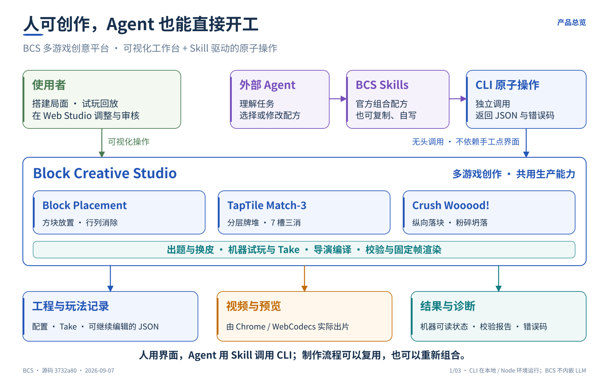
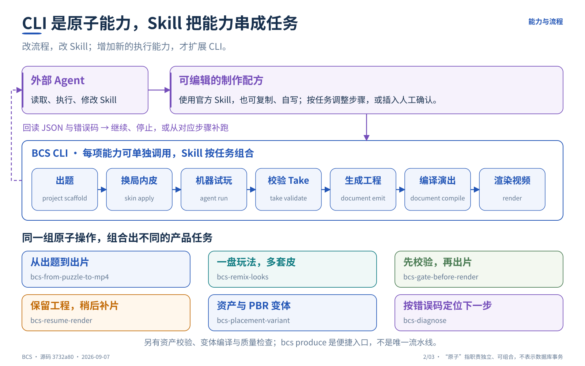
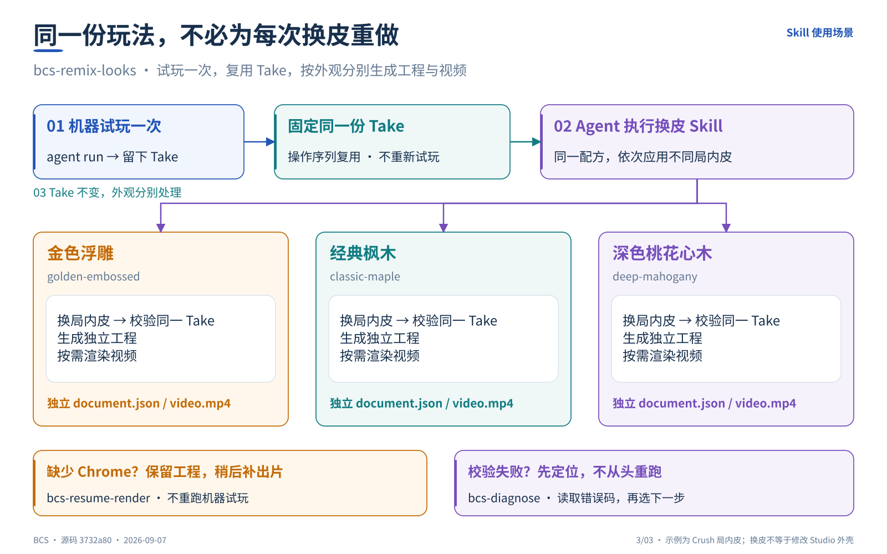

# 用 Agent 制作 BCS 素材

[返回产品首页](../../README.md) · [CLI 手册](../cli/README.md) · [Skill 入口](../../skills/bcs/SKILL.md)

BCS 提供两种入口：人通过 Web Studio 创作；外部 Agent 通过 Skill 组合原子 CLI。本文解释这些能力如何形成产品任务，不另写一套命令实现，也不把 Skill 当成内嵌模型或常驻工作流服务。

## 1. 三层职责



| 层 | 负责什么 | 不负责什么 |
|---|---|---|
| 外部 Agent | 理解需求，选择、读取或修改 Skill，调用命令，读取结果 | 不凭描述宣称未验证能力已经完成 |
| Skill | 描述命令顺序、输入输出、校验和停止条件；允许复制、自写 | 不复制游戏规则或成为第二套 CLI 实现 |
| CLI | 执行独立操作，生成文件、JSON 状态和机器可读错误 | 不内嵌 LLM；不以命令成功代替商业视觉验收 |

官方配方是起点，而不是锁死的生产流水线。调整多皮、确认点或补跑顺序应修改 Skill；确实缺少执行能力时，才扩展 CLI。`bcs produce` 只是默认路径的便捷命令。

## 2. 原子操作如何组成任务



下表是制作链路的职责概览，不代替各命令的参数手册。图中的连续箭头表示一条典型组合，不要求每个任务都从出题开始，也不表示数据库事务原子性。

| 任务中的一步 | CLI | 产物或判断 |
|---|---|---|
| 查看能做什么 | `capabilities` / `agent list` / `authoring catalog` | 可用命令、游戏适配器、题目与局内皮目录 |
| 出题 | `project scaffold` | 对应游戏的配置文档 |
| 换局内皮 | `skin apply` | 应用局内视觉选择后的配置 |
| 机器试玩 | `agent run` | 统一 Replay Envelope / Take 与回放报告 |
| 校验玩法记录 | `take validate` | Take 是否适用于指定游戏与配置 |
| 生成工程 | `document emit` | 包含玩法、Take 与生产配置的工程 |
| 编译演出 | `document compile` | 可求值的演出结果，不生成像素 |
| 渲染视频 | `render` | 调度 Chrome / WebCodecs，依据实际结果写出视频与回执 |

资产和 PBR 变体是另一条组合路径：`asset validate → variant compile → quality check`。不要把生成 Render Plan 画成已经编码 MP4，也不要把普通参数铜材质当作已经加载 PBR 贴图。

完整参数以 [CLI 手册](../cli/README.md)、[CLI 分派实现](../../src/cli/bcs.ts) 和 [Skills 索引](../../skills/README.md) 为准。

## 3. 六类官方组合 Skill

| 使用场景 | Skill | 复用的重点 |
|---|---|---|
| 从题目到可选视频 | [bcs-from-puzzle-to-mp4](../../skills/bcs-from-puzzle-to-mp4/SKILL.md) | 出题、试玩、校验、工程生成、按需渲染 |
| 同一盘玩法换多套外观 | [bcs-remix-looks](../../skills/bcs-remix-looks/SKILL.md) | 只试玩一次，保留同一份 Take |
| 渲染前检查 | [bcs-gate-before-render](../../skills/bcs-gate-before-render/SKILL.md) | 先校验 Take 和工程，再决定是否出片 |
| 已有工程补出片 | [bcs-resume-render](../../skills/bcs-resume-render/SKILL.md) | 满足运行条件后继续，不重新试玩 |
| Placement 资产与 PBR 变体 | [bcs-placement-variant](../../skills/bcs-placement-variant/SKILL.md) | 资产校验、变体编译和结构质量检查 |
| 遇错决定下一步 | [bcs-diagnose](../../skills/bcs-diagnose/SKILL.md) | 根据实际错误码定位，不盲目全量重跑 |

Skill 可以被外部 Agent 阅读和执行，也可以由人依照步骤操作。这里的“补跑”指利用已保存文件重新调用对应命令，不宣称已经具备通用持久任务队列、自动断点调度或事务恢复引擎。

## 4. 一个具体例子：一盘玩法，多套局内皮



使用 `bcs-remix-looks` 制作 Crush Wooood! 变体时，先出题并运行一次 `agent run`，保留配置和 `take.json`。之后对每套皮分别执行：

```text
skin apply
    → take validate（同一份 Take + 换皮后的配置）
    → document emit（独立工程）
    → render（按需）
```

金色浮雕 `golden-embossed`、经典枫木 `classic-maple` 和深色桃花心木 `deep-mahogany` 是现有 Skill 中的局内皮，不是编辑器外壳。每个变体使用独立目录，Take 共用。

Crush / TapTile 的局内皮不改变玩法哈希，但仍需重新校验。Placement 的 Look 写在 `document.production.lookPackRef`；`skin apply` 不负责修改棋盘配置，生成工程时要传递对应 Look。细节以 [现有换皮 Skill](../../skills/bcs-remix-looks/SKILL.md) 为准。

校验失败应停止并读取错误，不得为继续出片而静默重新试玩。缺少 Chrome 时保留工程，随后使用 `bcs-resume-render` 补渲染；这两种情况不能混为同一种成功。

## 5. 怎样解释结果

| 结果 | 可以说明什么 | 不能说明什么 |
|---|---|---|
| 命令 `ok` | 该命令约定的执行或校验成功 | 不保证游戏通关，也不保证已经生成视频 |
| Take 校验通过 | 指定游戏、配置和动作序列满足回放检查 | 不代表美术或演出质量合格 |
| 演出编译完成 | 工程已被编译为演出数据 | 不代表生成了像素或 MP4 |
| `rendered: true` | 对应渲染路径报告视频已实际编码 | 不代表人工商业视觉批准 |
| `CHROME_NOT_FOUND` | 当前环境缺少渲染依赖，可在条件满足后补跑 | 不能把工程存在当作出片成功 |

`--max-frames` 是截断预览选项，不能用于宣称完整交付。CLI 的短预览与 [Studio 统一视觉片单](../LOCAL_REVIEW_AND_FEEDBACK.md) 应分开评审。

## 6. 产品边界

三款演示游戏的 CLI ID 为 `block-placement`、`taptile-tray-match3`、`block-crush-drop`。`mahjong-solitaire` 是 Coming Soon，没有 Agent、authoring 或 render 适配器。

外部 Agent 与 `agent run` 不是同一层：前者编排任务，后者调用游戏注册的机器试玩适配器。BCS 不选择 LLM，也不依赖截图猜测规则状态。

GitHub Pages 只承载前端 Studio，不运行 Node CLI。`render` 和 `produce --render` 由本地或合适的执行环境调度 Chrome，像素渲染与编码实际发生在浏览器中。

BCS Skills 首先服务 BCS 内部制作。AE、Blender、Audio 操作属于另外的专业工具契约；已有专用桥接不等于所有游戏都支持通用 DCC 交接。中央元素库治理和跨工具回流是后续建设方向，不应在这套产品图中冒充已交付能力。

工程 JSON、玩法记录、交换文件与可投放试玩包也不是同一种产物。是否支持某类输出，应逐项核对具体游戏、命令和适配器。

## 7. 图文来源与维护

图示基于已审阅的 `3732a804c00066d748039134b2f3993a7ff43f0d`（CLI / Skills 合入版本）；本次文档针对 `669df56e379c16050b2c25029dbc3b9250a8e167` 复核。图中保留原始快照页脚，避免把示意图当成实时能力发现接口。

主要依据为 [Skills 分层说明](../../skills/README.md)、[Skill 入口](../../skills/bcs/SKILL.md)、上述六份组合 Skill、[CLI 手册](../cli/README.md) 和 [CLI 命令分派](../../src/cli/bcs.ts)。可编辑图源与更新规则见 [产品图说明](../images/product/README.md)。

这次更新是产品文档与图示整理，不代表重新完成了游戏、渲染或商业视觉验收。
